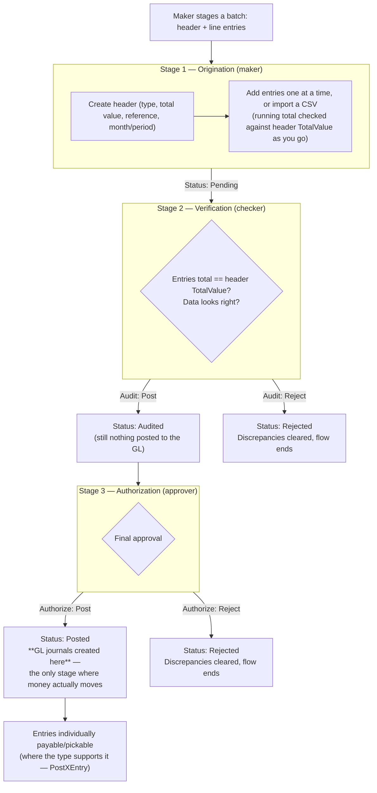
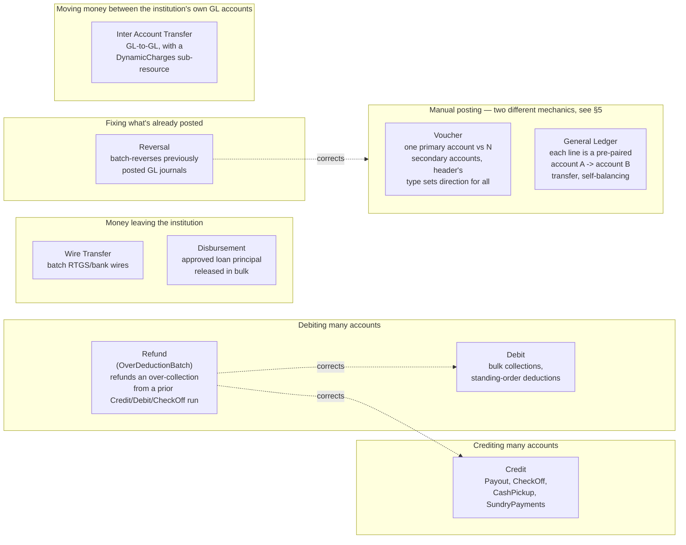
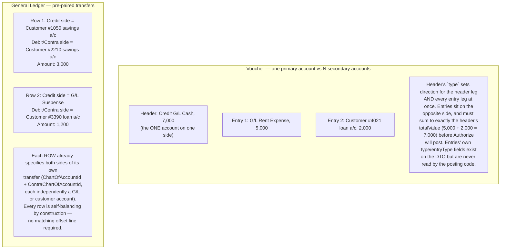

# Batch Procedures — Functional Basis

Audience: anyone building the remaining `Areas/Accounts/Controllers/*BatchController.cs`
adaptations (Debit, Refund, Wire Transfer, Disbursement, Reversal, Voucher,
General Ledger, Inter Account Transfer), or wondering why `NavigationMenu.cs`
splits every batch type into three separate "Origination / Verification /
Authorization" menu groups.

Source: reference `SwiftFinancials.Web/Areas/Accounts/Controllers/BatchOrigination_*`,
`BatchVerification_*`, `BatchAuthorization_*`, `CreditBatchController.cs`
(reference) / `CreditBatchController.cs` (this repo, already built),
`CreditBatchAppService.cs`, `Infrastructure.Crosscutting.Framework/Utils/NavigationMenu.cs`.

## 1. The pattern: batch = bulk GL posting under three-way segregation of duties

Every one of the nine types is the same shape underneath: a **header**
(who/what/how much in total) plus **line entries** (the individual
postings), moved through three gates before the GL is touched. This is
standard segregation-of-duties control for anything that moves money across
many beneficiaries at once — no single person can originate *and* approve
their own batch.

Three real roles, not a two-step approval:

1. **Maker** (Origination) — stages the batch, has zero authority to post.
2. **Checker** (Verification) — audits correctness, still can't post.
3. **Approver** (Authorization) — the only one whose action creates GL
   journals. For types with a `PostXEntry` method (Credit, Debit, Wire
   Transfer, Reversal, Disbursement — see §3), individual entries only
   become payable *after* the batch itself reaches `Posted` here; for types
   without one (Refund, Voucher, General Ledger, Inter Account Transfer —
   confirm per type), Authorization posts every line at once.

This is the exact same maker-checker principle already enforced elsewhere
in this codebase (teller cash-deposit requests above a limit, the generic
`Workflow` engine) — Batch Procedures is that same control applied to
*bulk* postings instead of one transaction at a time. `NavigationMenu.cs`'s
three menu groups are a role-routing artifact of that (different people see
different stages) — not a reason to build three separate backend
controllers. `CreditBatchController` already proved one REST controller
with `/{id}/audit` and `/{id}/authorize` actions covers all three stages;
the plan is to keep doing that for the other eight.

## 2. What each type is actually for

| Type | Functional purpose | Backing DTO / service |
|---|---|---|
| **Credit** | Crediting many member accounts from one source in one run. `Payout` = savings/dividend interest payout runs. `CheckOff` = an employer remits one lump sum of payroll deductions; the batch allocates it across many members' loan repayments, share contributions, welfare/insurance premiums, etc. — confirmed in `CreditBatchAppService`, which has explicit `CheckOffEntryType` handling per product line (`sLoan`, `sInterest`, `sShare`, `wCont`, `sInvest`, `sRisk`, `wLoan`, `sLoanInterest`). `CashPickup`/`SundryPayments` pay non-members. | `CreditBatchDTO` / `ICreditBatchAppService` — **built** (`CreditBatchController.cs`) |
| **Debit** | The mirror of Credit — bulk debits off many member accounts in one run (standing-order collections, bulk fee/charge deductions). No sub-type enum, unlike Credit. | `DebitBatchDTO` / `IDebitBatchAppService` |
| **Refund** | Correcting a Credit/Debit/CheckOff run that over-collected — refunds the excess back to affected members in bulk. **Confirmed while building** (`OverDeductionBatchController.cs`): `Authorize` posts every entry's journal(s) synchronously, inline — the only type in this module where that's true. | `OverDeductionBatchDTO` / `IOverDeductionBatchAppService` — **built** |
| **Wire Transfer** | Batch of outgoing external transfers (bank wires) — money leaving the institution to external accounts. | `WireTransferBatchDTO` / `IWireTransferBatchAppService` |
| **Disbursement** | Releasing approved loan principal to members in bulk, after a loan case has cleared appraisal/approval upstream. Interface also exposes `DisburseMicroLoan` and a transaction-threshold validator that look like a separate alternate-channel (USSD/API) disbursement path, not part of this batch UI — confirm with product before deciding whether those belong on the same controller. | `LoanDisbursementBatchDTO` / `ILoanDisbursementBatchAppService` (lives in `BackOfficeModule`, but the reference app still routes its screens under Areas/Accounts) |
| **Reversal** | Batch-reversing previously posted GL journals — corrections to postings already authorized elsewhere. | `JournalReversalBatchDTO` / `IJournalReversalBatchAppService` |
| **Inter Account Transfer** | Bulk GL-to-GL transfers between chart-of-accounts (branch/cost-center reallocation), with a `DynamicCharges` sub-resource for transfer fees. | `InterAccountTransferBatchDTO` / `IInterAccountTransferBatchAppService` |
| **Voucher** | One primary account (the header, at `TotalValue`) on one side, versus however many entries you attach — each its own account and amount — collectively on the other side. The header's single `Type` sets direction for the header leg *and* every entry leg at once; there's no per-entry direction despite entries carrying their own (unread, decorative) `Type`/`EntryType` fields — see §5. Splits one side of a transaction across several accounts — general-purpose adjusting entries, cost allocations. Own status/auth-option enums (`JournalVoucherStatus`/`JournalVoucherAuthOption`). `Authorize` posts synchronously, like Refund. | `JournalVoucherDTO` / `IJournalVoucherAppService` — **built** (`JournalVoucherController.cs`) |
| **General Ledger** | A batch of **pre-paired account-to-account transfers** — each single entry row carries *both* a credit-side account (`ChartOfAccountId`/`CustomerAccountId`) *and* a debit/contra-side account (`ContraChartOfAccountId`/`ContraCustomerAccountId`) at once, each side independently resolvable to a raw G/L account or a customer account. Every row is self-balancing by construction (no matching offset line needed, unlike Voucher) — this is a bulk "move money from specific account A to specific account B" correction/transfer tool, not a free-form journal. **Verified against `AuthorizeGeneralLedger` directly** (not just inferred from the DTO, after the Voucher lesson): confirmed accurate, plus one thing the DTO alone wouldn't tell you — every entry posts as **its own separate `Journal`** (unlike Voucher's one-shared-journal-many-legs, or Credit/Debit/Wire Transfer's per-entry-but-async journals). The header (`GeneralLedgerDTO`) carries no account fields of its own at all — unlike Voucher, there's no "primary" account, it's purely a container for already-self-balancing entries. `Authorize` posts synchronously like Refund/Voucher, but throws an exception (not a quiet `false`) if entries don't sum to `TotalValue`. Own parallel enums (`GeneralLedgerStatus`/`GeneralLedgerAuthOption`). | `GeneralLedgerDTO` / `IGeneralLedgerAppService` — **built** (`GeneralLedgerController.cs`) |

## 3. Which types let you pay out entry-by-entry vs. all at once

Not every type behaves like Credit's `CashPickup` (browse individually
payable entries after the batch posts). Interface surface as of this
writing:

| Type | Has `PostXEntry` (per-entry payout)? | Has `FindQueableXEntries`? | Has CSV import (`ParseXImport`)? |
|---|---|---|---|
| Credit | Yes | Yes (Payout/CheckOff only) | Yes |
| Debit | Yes | Yes | Yes |
| Wire Transfer | Yes | Yes | Yes |
| Reversal | Yes | Yes | No |
| Disbursement | Yes | Yes | No |
| Refund | No | No | Yes |
| Voucher | No | No | No |
| General Ledger | No | No | Yes (`ParseGeneralLedgerImportEntries`) |
| Inter Account Transfer | No | No | No |

CSV import is out of scope for all of them in the near term regardless —
none of this project's controllers have a file-upload pattern yet, so it's
one shared initiative later rather than five ad hoc ones now.

## 4. Comparison to Microsoft Dynamics 365

The closest analogue is Dynamics' **Journals + Journal Batches + batch
approval workflows**:

| This system | Dynamics 365 (Business Central / F&O) |
|---|---|
| Voucher / General Ledger | **General Journal** — a journal batch/template posting arbitrary debit/credit lines to the G/L |
| Credit / Debit | **Payment Journal** (Credit — paying/crediting many accounts in one batch) or a **Direct Debit collection journal** (Debit — collecting from many accounts) |
| Wire Transfer | Payment Journal + **Export Payment File** (bank-file generation for EFT/wire batches) |
| Disbursement | Closest to a Payment Journal releasing funds against an approved upstream commitment — Dynamics has no native "loan disbursement," that's a lending-vertical concept here too |
| Reversal | BC's native **Reverse Transaction / Correction** on posted G/L entries |
| Inter Account Transfer | **Bank Account Transfer** journal / intercompany posting, with charges attached |
| Origination → Verification → Authorization | Dynamics' **journal batch approval workflows** (submit → review → approve; posting only happens on final approval) — same three-gate control, configured via workflow rules instead of hardcoded stages |

Nothing here is exotic — it's a fairly textbook core-banking
batch-posting-with-approval-workflow design.

## 5. Settled: Voucher vs. General Ledger are genuinely different tools

From the app-service interface alone these looked like the same concept
twice (same CRUD/audit/authorize shape, same "replace the whole entry
collection" update method, only the enum names differ) — this codebase has
precedent for exactly that kind of duplication being real (Commission had a
redundant, buggier `ChargesController` — see
`COMMISSION-LEVY-CHARGE-CONCEPTS.md`). Reading the entry DTOs plus both
reference controllers settles it: they are not redundant. But the first
pass at this section (based on `JournalVoucherEntryDTO`'s field shape
alone) mischaracterized Voucher — corrected below after actually reading
`JournalVoucherAppService.AuthorizeJournalVoucher`, which is the only
reliable source of truth for what a type in this module really does. The
lesson generalizes: **a DTO's fields are not proof of behavior in this
codebase** — `JournalVoucherEntryDTO` carries its own `type`/`entryType`
fields that look like independent per-line debit/credit control, and nobody
consulted the posting code, they'd build a UI around a capability that
doesn't exist server-side.

**Voucher, correctly**: not a free-form N-line journal where each line
picks its own side. It's one **primary** account — the header's own
`chartOfAccountId` (+ optional `customerAccountId`), at `totalValue` — on
one side, and however many **entries** you attach, each its own
`chartOfAccountId` (+ optional `customerAccountId`) and own `amount`,
collectively on the *other* side. The header's single `type`
(`JournalVoucherType`: Debit/Credit × G/L/Customer) sets the direction for
**both** the header leg and every entry leg at once — there is no per-entry
direction. Confirmed by `AuthorizeJournalVoucher`'s posting loop, which
switches on the header's `type` only; each `JournalVoucherEntryDTO`'s own
`type`/`entryType` fields are never read anywhere in
`JournalVoucherAppService` — decorative DTO fields, not a real capability.
Posting only proceeds once entries' `amount` sums to exactly `totalValue`.

**General Ledger, unchanged from the original read**: each entry *row*
already specifies both sides of its own transfer (`chartOfAccountId` +
`contraChartOfAccountId`, each independently a G/L or customer account) —
self-balancing by construction, no matching offset row required.

| | Voucher | General Ledger |
|---|---|---|
| Unit of an entry | One account, sharing the header's single direction | A pair of accounts (credit side + contra/debit side) in one row |
| How direction is chosen | Once, at the header (`type`) — applies to every entry too | Per row — each row independently picks a credit account and a contra/debit account |
| How a batch balances | Entries' `amount` must sum to exactly the header's `totalValue` | Automatically — each row is a complete transfer by itself |
| Typical use | Splitting one side of a transaction across several accounts — e.g. one G/L credit allocated across many expense lines or member accounts | Bulk account-to-account corrections/transfers — moving or fixing money between two *specific* accounts, often two member accounts |
| Entry-side account resolution | `ChartOfAccountId` (single) | `ChartOfAccountId` (credit) **and** `ContraChartOfAccountId` (debit), each resolvable via `CreditCustomerAccountLookUp`/`DebitCustomerAccountLookup` against a real customer account |

Both are built as designed — Group B is complete. Voucher:
`JournalVoucherController.cs`, `docs/api/batch-procedures-api-spec.md` §7.
General Ledger: `GeneralLedgerController.cs`, same doc §8 — its posting
mechanics were verified directly against `AuthorizeGeneralLedger` (not
assumed from `AddGeneralLedgerController`'s `CreditCustomerAccountLookUp`/
`DebitCustomerAccountLookup` UI shape) and held up: each entry really is a
self-contained double-entry transfer, plus one detail the DTO wouldn't
reveal — every entry posts as its own separate `Journal`.
