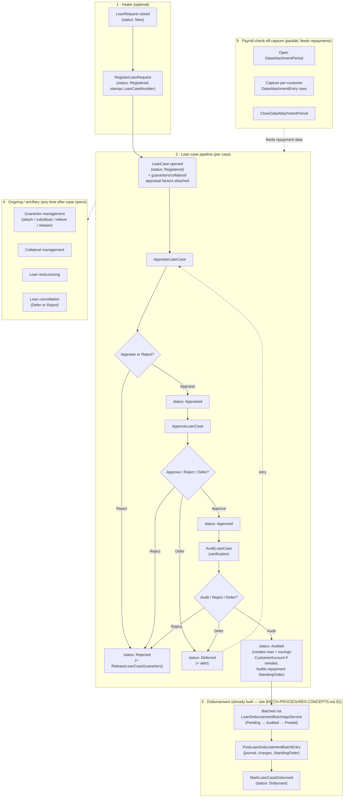
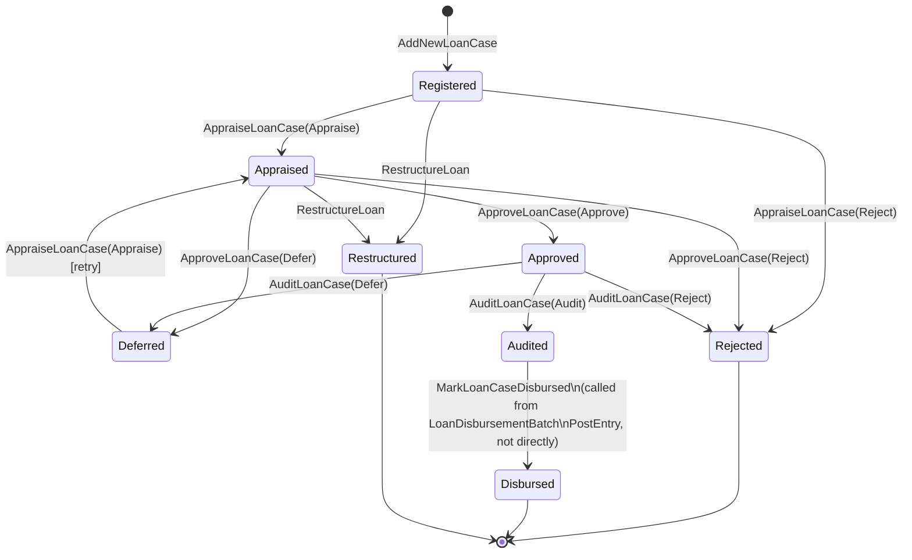
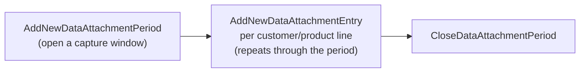

# Back Office — Functional Workflow

Audience: anyone about to adapt the `BackOfficeModule` app services into a
`WebApplication1` API surface (no controllers exist yet — see §9) who needs
to understand *what the back office is supposed to do*, not just what one
app-service method returns. This is a functional/process reference, not an
API spec — there is no `docs/api/*.md` for this module yet either; write one
alongside the first controller, following the pattern in
`docs/api/batch-procedures-api-spec.md`.

Source of truth:
- Functional design: reference MVC app,
  `SwiftFinancials.Web/Areas/Loaning/{Controllers,Views}/*` (read-only,
  sibling checkout — see root `CLAUDE.md`). Note the reference app calls
  this Area "Loaning", not "Back Office" — see §1.
- Domain aggregates: `Domain.MainBoundedContext/BackOfficeModule/Aggregates/*`.
- App services: `Application.MainBoundedContext/BackOfficeModule/Services/*`.
- DTOs: `Application.MainBoundedContext.DTO/BackOfficeModule/*`.
- The one piece already adapted: `Application.MainBoundedContext/BackOfficeModule/Services/LoanDisbursementBatchAppService.cs`
  → `WebApplication1/Areas/Accounts/Controllers/LoanDisbursementBatchController.cs`
  (documented in `Areas/Accounts/BATCH-PROCEDURES-CONCEPTS.md` §2 and
  `docs/api/batch-procedures-api-spec.md` §6 — not duplicated here).
- Enums referenced throughout:
  `Infrastructure.Crosscutting.Framework/Utils/Enumerations.cs`
  (`LoanCaseStatus`, `LoanRequestStatus`, `LoanAppraisalOption`,
  `LoanApprovalOption`, `LoanAuditOption`, `LoanCancellationOption`).

## 1. What "Back Office" means here

`BackOfficeModule` is this codebase's own namespace for the **loan
origination pipeline**: request intake → loan case registration →
appraisal → approval → audit/verification → guarantor & collateral
management → disbursement, plus the payroll/check-off "data attachment"
capture that feeds employer-remitted loan repayments into the same
pipeline. The codebase's own permission model agrees with this scope —
`ModuleNavigationItem` has distinct `BackOfficeLoanAppraisal`/
`BackOfficeLoanApproval`/`BackOfficeLoanAudit` codes, separate from
`FrontOfficeLoanAppraisal`/etc.

Two naming traps worth calling out explicitly, so nobody rediscovers them
mid-build:

- **The reference MVC app does not have an `Areas/BackOffice` folder.** The
  same functionality lives under `Areas/Loaning` there — 23 controllers,
  listed in §9. `Areas/BackOffice` in this repo (this doc's location) is a
  new name choice, matching the domain/application-layer namespace rather
  than the reference app's Area name, since "Loaning" reads as a product
  name and "BackOffice" is what the rest of this codebase (enums,
  permissions) already calls it.
- **This is a different "back office" than the one `FrontOffice/WORKFLOW.md`
  §1 refers to.** That doc uses "back office" loosely, to mean
  `Registry`/`Admin` master data (customer records, products, company
  config) — nothing to do with loans. This doc's "Back Office" is the
  `BackOfficeModule` bounded context specifically. Don't conflate the two
  when cross-referencing.

## 2. End-to-end functional map

## 3. Actors

| Actor | Role |
|---|---|
| Loan officer / registrar | Opens the `LoanCase` (`LoanRegistration` screen in the reference app), attaches guarantors/collateral |
| Appraiser | Runs `AppraiseLoanCase` — income/affordability assessment, appraisal factors, income adjustments |
| Approver | Runs `ApproveLoanCase` — the maker-checker gate on the appraiser's recommendation |
| Auditor / verifier | Runs `AuditLoanCase` — the final verification gate before a case is eligible for disbursement; this is the step that actually creates the customer's loan/savings accounts and repayment schedule |
| Batch maker/checker/approver | Same three-role segregation as every other Batch Procedures type — see `BATCH-PROCEDURES-CONCEPTS.md` §1 — applied to `LoanDisbursementBatch` |
| Payroll/data-capture clerk | Opens/closes `DataAttachmentPeriod`s and enters employer check-off deduction data per customer |
| Customer | Optionally raises a `LoanRequest`; is the subject of appraisal/approval/audit; provides guarantors/collateral |

## 4. Loan case status — the core state machine

`LoanCaseStatus`: `Registered`, `Appraised`, `Approved`, `Disbursed`,
`Rejected`, `Deferred`, `Audited` (UI label "Verified"), `Restructured`.

All four transition methods (`AppraiseLoanCase`, `ApproveLoanCase`,
`AuditLoanCase`, `MarkLoanCaseDisbursed`) live on `ILoanCaseAppService` /
`LoanCaseAppService.cs`, driven by their own option enums
(`LoanAppraisalOption{Appraise,Reject}`,
`LoanApprovalOption{Approve,Reject,Defer}`,
`LoanAuditOption{Audit,Reject,Defer}`). `CancelLoanCase` is a separate exit
path, gated by `LoanCancellationOption{Defer,Reject}`, available while a
case is still in an eligible pre-disbursed state.

**A shortcut exists**: if `LoanRegistration.BypassAudit` is set,
`ApproveLoanCase` auto-chains straight into `AuditLoanCase` — a case can go
Appraised → Audited in one call, skipping the audit step as a distinct
human action. Worth surfacing in a future controller/UI (e.g. as a flag on
the approve response) rather than silently happening.

**Known latent bug — fixed in `AppraiseLoanCase`/`Async`,
`ApproveLoanCase`/`Async`, and `AuditLoanCase`/`Async`** (found while
reading `LoanCaseAppService`, same audit discipline used elsewhere in this
repo — see the Voucher/General Ledger and InterAccountTransferBatch
corrections in `BATCH-PROCEDURES-CONCEPTS.md`): the guard-clause pattern in
all three methods was `persisted.Status = (int)ExpectedPriorStatus; if
(persisted.Status == (int)ExpectedPriorStatus) { ... }` — i.e. the code
force-set the *expected* prior status onto the just-fetched entity
immediately before checking it (and before even null-checking it, so a
missing loan case id threw a `NullReferenceException` instead of a clean
"not found"), making the check tautologically always true. Fixed in
`AppraiseLoanCase`/`AppraiseLoanCaseAsync` alongside `LoanCaseController`'s
`POST .../appraise` endpoint (§14.2), in `ApproveLoanCase`/
`ApproveLoanCaseAsync` alongside `POST .../approve` (§14.3), and in
`AuditLoanCase`/`AuditLoanCaseAsync` alongside `POST .../audit` (§14.4).
**`MarkLoanCaseDisbursed` does not have this bug** — its own guard is a
plain `switch` on the entity's real status with no force-set, correctly
written. It had a different, more consequential bug instead — see below.

**Second, separate, more severe bug — fixed in `MarkLoanCaseDisbursed`**
(found even later, while verifying the already-live
`LoanDisbursementBatchController` against this doc's own state machine
once §14.1-14.4 were all built — a good example of why re-checking
"already done" work is still worth it): the method's `switch` only matched
`case LoanCaseStatus.Approved:`, but this diagram's own `Audited -->
Disbursed` transition (and the reference app's own batch-picker screen,
which filters `LoanCaseStatus.Audited`) says a case must be `Audited` —
not `Approved` — before it's eligible for disbursement. `Approved`
(`0xBEBA+2`) and `Audited` (`0xBEBA+6`) are distinct enum values, so the
`switch`'s `default` case silently did nothing and returned `false` for
every loan case that had actually gone through the intended pipeline. Since
`MarkLoanCaseDisbursed` is called from
`LoanDisbursementBatchAppService.PostLoanDisbursementBatchEntry` **after**
the disbursement journal already posts real money, the practical effect
was: the loan disburses, but the case never flips to `Disbursed`, and the
repayment `StandingOrder` never gets created (gated on this call
succeeding). Fixed to match `Audited`. Full detail:
`docs/api/batch-procedures-api-spec.md` §6.3.

The state machine described above is the *intended* design; both bugs were
gaps between intent and enforcement, not reasons to doc a different design.

## 5. Loan request intake (optional pre-case stage)

`LoanRequestStatus`: `New → Registered` (once a `LoanCase` is opened
against it — `RegisterLoanRequest` stamps `LoanCaseNumber` on the request)
or `New → Rejected` (`CancelLoanRequest`). Purely an "expression of
interest" record; a `LoanCase` can also be opened directly without one.

## 6. Appraisal

`AppraiseLoanCase` (`Registered`/`Deferred` → `Appraised` or `Rejected`).
Backed by `UpdateLoanAppraisalFactors` (the appraisal worksheet line items)
and `IIncomeAdjustmentAppService` (allowance/deduction catalogue entries
used to compute adjusted income during appraisal —
`IncomeAdjustmentType{Allowance,Deduction}`). Reference screen:
`AppraiseLoanController` — has its own income-adjustment lookup and
appraisal-factor add/remove sub-actions, plus a print/confirmation step.

## 7. Approval

`ApproveLoanCase` (`Appraised` → `Approved`/`Rejected`/`Deferred`) — a
straightforward maker-checker gate on the appraiser's recommendation, no
sub-resources of its own. Reference screen: `ApproveLoanController`.

## 8. Audit / verification

`AuditLoanCase` (`Approved` → `Audited`/`Rejected`/`Deferred`) — the
consequential step: this is where the customer's loan and savings
`CustomerAccount`s get created (if they don't already exist), charges/
present-value/payment amounts get computed, and the repayment
`StandingOrder` gets built or updated. Everything downstream (disbursement
batching) depends on a case reaching `Audited`. Reference screen:
`LoanVerificationController` (named "Verify" in the reference UI, "Audit" in
the app-service method name — same step, see the equivalent status-label
mismatch noted for `AccountClosureRequestAppService` in
`Areas/FrontOffice/WORKFLOW.md` §9).

## 9. Guarantors and collateral

Guarantor management is the single largest sub-surface, split across seven
methods on `ILoanCaseAppService`:

| Method | Purpose | Reference screen |
|---|---|---|
| `AddNewLoanGuarantor` / `UpdateLoanGuarantors` | Attach guarantors when opening/editing a case | `LoanRegistrationController`, `GuarantorManagementController` |
| `AttachLoanGuarantors` | Attach a guarantor's own account as security | `AttachGuarantorController` |
| `SubstituteLoanGuarantors` | Swap one guarantor for another mid-case | `GuarantorSubstitutionController` |
| `RelieveLoanGuarantors` | Release a guarantor's obligation (e.g. loan paid down enough) | `GuarantorRelievingController` |
| `ReleaseLoanGuarantors` / `ReleaseRefinancedLoanGuarantors` | Bulk release, incl. on rejection (§4) or refinance | Called internally from `AppraiseLoanCase`/`ApproveLoanCase` reject paths, and from restructuring |
| `RemoveLoanGuarantors` | Hard removal | `LoanGuarantorController` |

`GuarantorAttachmentController` in the reference app manages an attachment
*history* trail (`LoanGuarantorAttachmentHistoryAgg`), separate from the
live attach/relieve actions above.

`UpdateLoanCollaterals` (single method) covers collateral attach/edit —
reference screen `AddCollateralController`.

## 10. Restructuring and cancellation

`RestructureLoan` — reference screen `LoanRestructuringController`,
produces status `Restructured`. `CancelLoanCase` — reference screen
`LoanCancellationController`, exits to `Deferred` or `Rejected` per
`LoanCancellationOption`. Neither has been read in as much depth as the
core appraise/approve/audit path above; confirm exact pre/post-conditions
against `LoanCaseAppService` directly before building their controllers,
same discipline as §4's bug-finding.

## 11. Disbursement

Already built — see `Areas/Accounts/BATCH-PROCEDURES-CONCEPTS.md` §2 and
`docs/api/batch-procedures-api-spec.md` §6 for the full batch
Origination/Verification/Authorization flow, and
`Areas/Accounts/Controllers/LoanDisbursementBatchController.cs` for the
live controller. Not duplicated here; two facts worth repeating in this
doc's context:

- The intended source status is `Audited` (the reference app's own
  batch-picker screen filters `LoanCaseStatus.Audited`), but this is only
  enforced by client-side filtering — `AddNewLoanDisbursementBatchEntry`
  and the bulk `UpdateLoanDisbursementBatchEntries` path check only that
  the `LoanCase` isn't already batched (plus matching
  `loanProductCategory`, for bulk-add), never its `Status`. A case in any
  status, including `Rejected`, can technically be added via the API today
  — a gap, not a guarantee, despite an earlier version of this doc claiming
  otherwise.
- Posting an entry ends with `MarkLoanCaseDisbursed`, closing the loop back
  into §4's state machine — this had its own real bug (checked `Approved`
  instead of `Audited`, silently breaking disbursement completion for every
  correctly-audited case), found and fixed after §14.1-14.4 were built. See
  §4 and `docs/api/batch-procedures-api-spec.md` §6.3.

## 12. Payroll / check-off data capture

A parallel track that feeds employer-remitted loan repayment data into the
system, independent of any single `LoanCase`'s appraisal state:

Reference screens: `DataCaptureController` (open/edit period),
`DataProcessingController` (per-customer entry capture, with customer/
customer-account lookups), `ClosingController` (close), `CatalogueController`
(browse captured entries). `FindCurrentDataAttachmentPeriod` (and a cached
variant) resolve "the currently open period" for the capture screen without
requiring the caller to track a period ID. This is what later shows up as
`CheckOff`-type entries in `CreditBatchAppService` (per
`BATCH-PROCEDURES-CONCEPTS.md` §2's Credit row) — not itself a loan-case
transition, but the upstream data source for one.

## 13. Reference-data catalogues

Three simple lookup CRUD services, no workflow of their own — built as
plain CRUD controllers once their first consumer needed them: the loan-case
registration/appraisal screens' pickers (§14.1, §14.2, §15.2). Same shape as
`UnPayReasonController` (`Description` `[Required]`, `IsLocked` toggle,
duplicate-description reported via `ErrorMessageResult` on the echoed-back
DTO rather than a thrown exception).

| Service | Backs | Reference screen | This repo |
|---|---|---|---|
| `ILoaningRemarkAppService` | Free-text remark catalogue attached to loan-case decisions | `LoaningRemarkController` | **Live** — `Areas/BackOffice/Controllers/LoaningRemarkController.cs`, `api/backoffice/loaningremarks` |
| `ILoanPurposeAppService` | Loan purpose catalogue (why the loan is being taken) | `LoanPurposeController` | **Live** — `Areas/BackOffice/Controllers/LoanPurposeController.cs`, `api/backoffice/loanpurposes` |
| `IIncomeAdjustmentAppService` | Allowance/deduction catalogue used in appraisal (§6) | `IncomeAdjustmentsController` | **Live** — `Areas/BackOffice/Controllers/IncomeAdjustmentController.cs`, `api/backoffice/incomeadjustments` |

Full reference: `docs/api/loan-backoffice-catalogues-api-spec.md`. This
also resolves most of §15.2's picker gap — the fourth one there
(collateral documents) is a `RegistryModule` concern, not
`BackOfficeModule`, and is documented separately: see
`Areas/Registry/Controllers/CustomerDocumentController.cs`
(`api/registry/customerdocuments`, read-only — deliberately doesn't expose
document upload, a separate feature).

`LoanProductAppraisalController` (product-level appraisal budget config,
not case-level) and `RepaymentScheduleController` (schedule preview,
`InterestCalculationsService`-adjacent) exist in the reference app but sit
closer to `AccountsModule`/product config than to a `LoanCase`'s own
lifecycle — evaluate them against `LoanProductController` and the existing
`InterestCalculationsService.LoanRepaymentCalculator` respectively when
their turn comes, rather than assuming they belong under `Areas/BackOffice`.

## 14. Implementation status in this repo

Nothing in this module has a controller yet except the disbursement tail.
No `Areas/BackOffice` (or `Areas/Loaning`) folder exists in
`WebApplication1` before this doc — creating one is the first step of
building any of the rows below.

| Functional area | Reference MVC controller | This repo | Status |
|---|---|---|---|
| Loan request intake | `LoanRequestController` | — | Not built |
| Loan case registration | `LoanRegistrationController` | `Areas/BackOffice/Controllers/LoanCaseController.cs` | **Live** — see §14.1 |
| Appraisal | `AppraiseLoanController` | `Areas/BackOffice/Controllers/LoanCaseController.cs` | **Live** — see §14.2 |
| Approval | `ApproveLoanController` | `Areas/BackOffice/Controllers/LoanCaseController.cs` | **Live** — see §14.3 |
| Audit / verification | `LoanVerificationController` | `Areas/BackOffice/Controllers/LoanCaseController.cs` | **Live** — see §14.4 |
| Cancellation | `LoanCancellationController` | — | Not built |
| Restructuring | `LoanRestructuringController` | — | Not built |
| Collateral | `AddCollateralController` | — | Not built |
| Guarantor attach | `AttachGuarantorController`, `GuarantorManagementController` | — | Not built |
| Guarantor attachment history | `GuarantorAttachmentController` | — | Not built |
| Guarantor relieving | `GuarantorRelievingController` | — | Not built |
| Guarantor substitution | `GuarantorSubstitutionController` | — | Not built |
| Guarantor CRUD/search | `LoanGuarantorController` | — | Not built |
| Loan purpose catalogue | `LoanPurposeController` | `Areas/BackOffice/Controllers/LoanPurposeController.cs` | **Live** — see §13 |
| Loaning remark catalogue | `LoaningRemarkController` | `Areas/BackOffice/Controllers/LoaningRemarkController.cs` | **Live** — see §13 |
| Income adjustment catalogue | `IncomeAdjustmentsController` | `Areas/BackOffice/Controllers/IncomeAdjustmentController.cs` | **Live** — see §13 |
| Loan product appraisal budget | `LoanProductAppraisalController` | — | Not built (see §13) |
| Data attachment period open/edit | `DataCaptureController` | — | Not built |
| Data attachment entry capture | `DataProcessingController` | — | Not built |
| Data attachment period close | `ClosingController` | — | Not built |
| Data attachment entry browse | `CatalogueController` | — | Not built |
| Repayment schedule preview | `RepaymentScheduleController` | — | Not built (see §13) |
| Loan reporting by status | `ReportsController` | — | Not built |
| **Disbursement batch** | `AuthorizeLoanBatchController` | `Areas/Accounts/Controllers/LoanDisbursementBatchController.cs` | **Live** — see §11 |

## 14.1 Loan case registration, as built

`LoanCaseController` (`ILoanCaseAppService`, existing) — full CRUD read
endpoints plus a `Create` that registers a new loan case with guarantors
and collateral in one call, and a guarantor eligibility lookup for the
registration screen. Unlike every controller built so far in the "Batch
Procedures" module, `AddNewLoanCase` itself does almost none of the real
business rules — it only rejects a duplicate in-process application for the
same customer/product and persists whatever `LoanCaseDTO` it's handed.
Every other rule the reference `LoanRegistrationController` enforces (the
~40-field loan-product-at-registration-time snapshot, minimum/maximum
guarantor counts, self-guarantee permission, guarantor share sufficiency,
the minimum-membership-period gate) lives in the reference *controller*
itself, a session/TempData-driven MVC wizard — so it had to be reproduced
here rather than assumed to already exist server-side, the same lesson
`BATCH-PROCEDURES-CONCEPTS.md` §5 already learned the hard way ("a DTO's
fields are not proof of behavior in this codebase" generalizes to "an app
service's existence is not proof it enforces the rules its callers assume
it does").

Two corrections made against the reference, not just ported forward:

- Guarantor share values (`TotalShares`/`CommittedShares`/`AppraisalFactor`)
  are computed server-side from real data (customer accounts,
  `FindLoanGuarantorsByCustomerId`, `GetGuarantorAppraisalFactor`) rather
  than trusted from the request body — same reasoning as the
  `InterAccountTransferBatch` `AvailableBalance` fix. This also means
  `LoanGuarantorDTO`'s own `ValidateAmountGuaranteed` validator (which
  correctly multiplies `TotalShares` by `AppraisalFactor`) is what actually
  gates a guarantor here — the reference controller's manual check never
  applied the appraisal factor at all, a real gap in the reference, not a
  simplification worth keeping.
- The reference `Create` action calls `loanCaseDTO.ValidateAll();` and then
  never checks `HasErrors` — every one of `LoanCaseDTO`'s `CustomValidation`
  rules (security sufficiency, amount-applied range, retirement age, budget
  balance) silently runs and is silently discarded. `LoanCaseController`
  checks `HasErrors` and returns 400 with the real messages instead.

**Real bug found and fixed in `LoanCaseAppService.UpdateLoanCaseAsync`
itself** (not just the controller): two lines immediately after the method
already restores `persisted.CreatedDate` to its original value re-stamped
it to `DateTime.UtcNow` right back, and unconditionally set `CancelledBy`
on every plain update — not just cancellations. Both lines directly
contradicted the method's own preceding comment ("Restore original values
that were overwritten") and were removed. Same class of bug as
`JournalReversalBatch`'s `UpdateJournalReversalBatch` fix elsewhere in this
codebase.

Deliberately not reproduced: `GetDocumentsAsync`'s raw ADO.NET query
against `swiftFin_SpecimenCapture` for passport/signature/ID photos, and
`LoaneeLookup`'s `MessageBox.Show(Form.ActiveForm, ...)` call — genuine
`System.Windows.Forms` code that cannot execute in a web request pipeline
at all, dead in the reference app's own web context. `LoaneeLookup`'s
composite "customer 360" view (standing orders, payouts, in-process loan
applications) was also not reproduced as a bespoke aggregate endpoint —
every piece already has (or, for in-process applications, now has here —
`GET .../customers/{customerId}/in-process`) its own real endpoint;
composing them again here would just duplicate
`StandingOrderController`/`CreditBatchController`.

Scope decision: `BranchId` is supplied by the caller on the request body,
not resolved server-side from "the current user's branch" — the reference
did that via `ApplicationUserManager` (ASP.NET Identity, MVC-only), and no
Web API controller in this repo performs that lookup today. Branch
budget-balance validation is left unpopulated, matching the reference
`Create` action's own behavior — real budget balance computation is
`IBudgetAppService`'s job, out of scope here.

## 14.2 Appraisal, as built

Added onto the same `LoanCaseController`, as lifecycle actions on the
`LoanCase` resource rather than a separate controller — the reference app
splits this into `AppraiseLoanController`, but this repo's own convention
(every Batch Procedures controller, `AccountClosureController`, etc.) is
one controller per resource with `/{id}/<action>` routes for each lifecycle
stage, not one controller per reference screen.

`GET .../{id}/appraisal-worksheet` reproduces the real, computable part of
the reference `GET Appraise` action — maximum loan via the product's
investments multiplier, outstanding balance on this specific loan product,
maximum entitled, a simple-interest loan+interest estimate, and a standard
amortization `PMT`. Not reproduced: the reference action's own `id`
parameter branch (treats a customer id as a loan product id and never uses
the result — dead/buggy there, not a real capability), an "isEmployee" loop
that iterates the customer's accounts and does nothing (`foreach (var
accts in findCustomerAccounts) { }`, empty body — literally dead code), and
the composite standing-orders/payouts/loan-applications view-model padding
(every piece already has its own real endpoint elsewhere, same reasoning as
`LoaneeLookup` above).

`POST .../{id}/appraise` takes the appraisal *outcome* fields directly in
the request body (net income, ability, system/appraised amount, remarks,
payback figures) plus an optional income-adjustments list, instead of a
whole `LoanCaseDTO` staged in `Session["Form"]` the way the reference does
— folds the reference's two separate calls
(`AppraiseLoanCaseAsync` + `UpdateLoanAppraisalFactorsAsync`) into one
request, same pattern as registration's `Create` folding guarantor/
collateral attach into one call.

**Real bug fixed in `LoanCaseAppService.AppraiseLoanCase`/`Async`
themselves, not just the controller** — see the updated bug note above §5:
the guard clause used to force-set `persisted.Status` to `Registered`
*before* even null-checking the fetched entity, so appraising a
non-existent loan case id threw a `NullReferenceException` instead of
returning a clean "not found," and the "must be Registered or Deferred"
precondition was tautologically always true for any case that did exist.
Removed the force-set; the guard now checks the entity's real status.

Full reference: `docs/api/loan-case-api-spec.md`.

## 14.3 Approval, as built

`POST .../{id}/approve` on the same `LoanCaseController`. Substantially
simpler than appraisal — no worksheet endpoint, since everything real an
approver needs is already on the loan case from registration/appraisal
(`GET /{id}` and `GET /{id}/appraisal-worksheet` cover it; a third
composite read endpoint would just duplicate them, same reasoning as
`LoaneeLookup` in §14.1).

**Found while building, not reproduced**: the reference `Approve` action
re-copies the same ~40 loan-product fields `Create` already snapshots onto
the DTO, right before calling `ApproveLoanCaseAsync` — but `ApproveLoanCase`
never reads any of them off the incoming DTO, only
`approvedAmount`/`approvedAmountRemarks`/`approvedPrincipalPayment`/
`approvedInterestPayment`/`monthlyPaybackAmount`/`totalPaybackAmount`/
`approvalRemarks` and the persisted entity's own `Id`/`Status`. Pure
busywork in the reference — the "a DTO's fields are not proof of behavior"
lesson from `BATCH-PROCEDURES-CONCEPTS.md` §5, this time applied to a
*controller* re-populating fields nobody downstream reads, not a DTO.

Also not reproduced: the reference calls `loanCaseDTO.ValidateAll()` and
never checks the result (same dead-validation-call shape already fixed in
`Create`) — but here it isn't even worth reproducing as a no-op, since the
`CustomValidation` rules it would run (amount-applied range, security
sufficiency, retirement age) were already meaningfully enforced once, at
`Create`, against a fully-populated DTO; running them again against a lean
approve-request payload would just produce validation noise for fields
this endpoint doesn't ask for. Real requirements are checked explicitly
instead: `approvalRemarks` always required, `approvedAmount > 0` required
only when `option == Approve` — the reference required a nonzero
`approvedAmount` even to reject or defer a case, which reads like
unconditional MVC form validation, not a deliberate business rule, so it
wasn't carried over for those two options.

**Real bug fixed in `LoanCaseAppService.ApproveLoanCase`/`Async`
themselves**: same guard-clause shape as appraisal (§14.2) — fixed the same
way, alongside this endpoint.

One behavior worth knowing before building a UI against this: if the loan
product has `LoanRegistrationBypassAudit` set, a successful `Approve` call
auto-chains straight into `AuditLoanCase` inside the same app-service call
— the response's loan case may already be `Audited`, not just `Approved`.
The endpoint's response `message` field says so explicitly when it happens
so a client doesn't have to infer it from `status` alone.

Full reference: `docs/api/loan-case-api-spec.md` §9.

## 14.4 Audit / verification, as built

`POST .../{id}/audit` on the same `LoanCaseController`. The consequential
transition — `AuditLoanCase` creates the customer's loan/savings
`CustomerAccount`s if missing, computes the repayment PV/PMT off
`LoanRegistration`/`LoanInterest` (both set at registration), recovers any
upfront dynamic charges, and builds or updates the repayment
`StandingOrder` — all inside the app service, driven entirely by fields
already on the persisted case from registration and approval. This
endpoint doesn't try to precompute or second-guess any of it — same
treat-it-as-a-black-box discipline `LoanDisbursementBatchController` uses
for `PostLoanDisbursementBatchEntry`.

Unlike appraisal/approval, this one needs almost no request body:
`{ option, auditRemarks }`. `AuditLoanCase` itself reads nothing else off
the incoming DTO — same "found, not reproduced" pattern as approval
(§14.3): the reference `Verify` action re-copies the ~40 loan-product
fields and calls `ValidateAll()` without checking the result, neither of
which does anything real here either. The one real requirement is the
reference's actual gate, `AuditRemarks != null` — required for every
option (Audit/Reject/Defer) here.

**Real bug fixed in `LoanCaseAppService.AuditLoanCase`/`Async` themselves**,
same guard-clause shape as appraisal and approval — fixed the same way,
completing the fix across all three of this pass's pipeline transitions.

**`MarkLoanCaseDisbursed` turned out not to share that bug** — its guard is
a plain `switch`, correctly written, no force-set. It had a different, more
consequential one instead, found on a follow-up pass verifying the
already-live `LoanDisbursementBatchController` against this doc's own state
machine: the `switch` only matched `case LoanCaseStatus.Approved:`, but a
correctly-audited case is `Audited` by the time it's disbursed — a distinct
enum value. The disbursement journal had already posted real money by the
time this ran (it's called after posting, inside
`PostLoanDisbursementBatchEntry`), so the practical effect was silent:
money moved, but the loan case never flipped to `Disbursed` and its
repayment `StandingOrder` never got created. Fixed to match `Audited` — see
§4 above and `docs/api/batch-procedures-api-spec.md` §6.3 for full detail.

Full reference: `docs/api/loan-case-api-spec.md` §10.

## 15. Frontend screens

What the frontend needs to build against the four live stages
(registration → appraisal → approval → audit/verification — §14.1-14.4).
Full request/response shapes: `docs/api/loan-case-api-spec.md`. Same
screen-collapse principle as `BATCH-PROCEDURES-CONCEPTS.md` §1.1: one
shared queue+detail shell reused across stages, not four one-off screens —
every stage lists the same `LoanCaseDTO` shape and differs mainly in which
status it filters on and which action button appears.

### 15.1 Screen list

| Screen | Who | Key API calls |
|---|---|---|
| Registration queue | Loan officer | `GET /?status=0` (`Registered`) |
| Register a loan case | Loan officer | §15.3 |
| Loan case detail | Anyone | `GET /{id}` (case + guarantors + collaterals) |
| Appraisal queue | Appraiser | `GET /?status=0` (same `Registered`/`Deferred` queue registration uses — appraisal is the next action on those same cases) |
| Appraise a loan case | Appraiser | §15.4 |
| Approval queue | Approver | `GET /?status=1` (`Appraised`) |
| Approve a loan case | Approver | §15.5 |
| Audit / verification queue | Auditor | `GET /?status=2` (`Approved`) |
| Audit / verify a loan case | Auditor | §15.6 |

Loan case detail (`GET /{id}`) is a shared read view every other screen
can link out to — every queue row should link to it, and it's the natural
"cancel and go back to detail" target from any of the three action screens.

`status` on the queue endpoints is a raw `LoanCaseStatus` int
(`Infrastructure.Crosscutting.Framework.Utils.Enumerations.cs`) — don't
hardcode the `0xBEBA`-based values client-side without a named constant;
no generic enum-listing endpoint exists anywhere in this API today (no
`EnumerationController`, despite `IEnumerationAppService` being
registered), so for a small fixed set like `LoanCaseStatus` the practical
choice is a client-side constants file mirroring the server enum, not a
runtime lookup call. Same for the `option` values on the three action
screens below (`LoanAppraisalOption`/`LoanApprovalOption`/`LoanAuditOption`
— each only 2-3 members) — these are cheap to hardcode too; they are not
the same category of gap as the reference-data pickers in §15.2, which
back growing, admin-managed tables and genuinely need a real list call.

### 15.2 Reusable picker components

Build these once, reuse across every screen below that needs them.

| Picker | Endpoint | Notes |
|---|---|---|
| Customer (loanee / guarantor) | `GET api/registry/customer/?text=&customerFilter=` | `docs/api/customer-api-spec.md` §5.1. Loanee must resolve to a customer with `recordStatus: 2` (`Approved`) — `Create` (§15.3) rejects otherwise, so filter or warn client-side if you can |
| Loan product | `GET api/accounts/loanproducts` | Unpaged list, standard envelope. No get-by-id route — resolve the picked product's `id`/`description` from this same list response, don't expect a separate detail call |
| Savings product | `GET api/accounts/savingsproducts` | Unpaged list — **not** wrapped in the standard `{success,message,data}` envelope, returns the raw `SavingsProductDTO[]` directly. Handle this one specially in your API client |
| Loan purpose | `GET api/backoffice/loanpurposes` | `docs/api/loan-backoffice-catalogues-api-spec.md` §1 |
| Registration remark | `GET api/backoffice/loaningremarks` | Same doc §2. Reference app's field label is "Remarks", not "Registration Remark" — the `LoanCaseDTO` field is `registrationRemarkId` |
| Income adjustment | `GET api/backoffice/incomeadjustments` | Same doc §3 |
| Collateral document | `GET api/registry/customerdocuments?customerId={id}&type=1` | `docs/api/loan-case-api-spec.md` §11. Requires the loanee's `customerId` already picked. Filter the result client-side to `collateralStatus: 0` (`Released`) — the endpoint doesn't filter for you |
| Guarantor eligibility | `GET api/backoffice/loancases/guarantors/lookup?guarantorId={id}&loanProductId={id}` | `docs/api/loan-case-api-spec.md` §4. Call once per guarantor after they're picked (via the Customer picker above) and the loan product is already selected — shows `totalShares`/`committedShares`/`appraisalFactor`/`availableToGuarantee` so the loan officer can enter a sane `amountGuaranteed` before submitting |

The loan purpose, registration remark, income adjustment, and collateral
document picker endpoints above are the four this session added
specifically to unblock the two form screens below (§15.3, §15.4) — none
existed before this pass. Guarantor eligibility lookup was already part of
`LoanCaseController` from when `Create` was first built (§14.1).

### 15.3 Register a loan case — build steps

`POST api/backoffice/loancases/` — full field/response reference:
`docs/api/loan-case-api-spec.md` §5.

1. **Loanee**: Customer picker (§15.2). On pick, optionally check
   `recordStatus` client-side and warn early if not `Approved` — `Create`
   will `400` on submit regardless, this just saves a round trip.
2. **Loan product**: Loan product picker (§15.2). Nothing else to resolve
   client-side — the server snapshots ~40 product fields onto the case
   itself; you only send `loanProductId`.
3. **Savings product**: Savings product picker (§15.2, note the unwrapped
   response).
4. **Loan purpose**: picker (§15.2) → `loanPurposeId`.
5. **Registration remark**: picker (§15.2) → `registrationRemarkId`.
6. **Amount applied / received date**: plain inputs → `amountApplied`,
   `receivedDate`.
7. **Branch**: `branchId` is a plain required field on the request — this
   API does not resolve "current user's branch" server-side (no
   `ApplicationUserManager`-equivalent lookup exists in this Web API yet).
   Source it from wherever the logged-in user's branch is already known
   client-side (auth/profile state), not a picker call.
8. **Guarantors** (repeatable row, only required at all if the picked loan
   product has `LoanRegistrationSecurityRequired: true` and isn't
   microcredit — you don't know this until the loan product picker returns
   its full `LoanProductDTO`, so gate the whole guarantors section on that):
   for each row, Customer picker to pick the guarantor, then the guarantor
   eligibility lookup (§15.2) to show real numbers, then a plain
   `amountGuaranteed` input. Send `{ guarantorId, amountGuaranteed }` per
   row — every other field on `LoanGuarantorDTO` is recomputed server-side,
   don't bother collecting or sending them.
9. **Collateral** (optional): Collateral document picker (§15.2), multi-select
   → `collateralDocumentIds: Guid[]`.
10. Submit `{ loanCase: {...}, guarantors: [...], collateralDocumentIds: [...] }`.
    On `400`, show the joined validation message (membership period,
    guarantor count/self-guarantee/sufficiency, amount-applied range,
    retirement-age restriction are all real server-side rules — see
    `loan-case-api-spec.md` §5 for the full list of what's checked and in
    what order). On `409`, the customer already has an in-process
    application for this product — `GET
    api/backoffice/loancases/customers/{customerId}/in-process` lets you
    check and warn *before* submit instead of only discovering it on
    failure.

### 15.4 Appraise a loan case — build steps

`POST api/backoffice/loancases/{id}/appraise` — full reference:
`docs/api/loan-case-api-spec.md` §7-8.

1. Load `GET /{id}/appraisal-worksheet` — system-computed qualification
   figures (max loan, outstanding balance, max entitled, loan+interest
   estimate, amortized `PMT`) plus the case, its guarantors, and its
   collaterals in one call. Show these as the starting point for the
   appraiser to confirm or override, not as read-only display — the fields
   below are what actually gets submitted.
2. **Income adjustments**: Income adjustment picker (§15.2), repeatable,
   each row = `{ incomeAdjustmentId, customerAccountId?, amount, isEnabled }`.
   `description`/`type` are filled in server-side from the catalogue —
   don't collect or send them.
3. Appraiser enters/confirms: `appraisedNetIncome`, `appraisedAbility`,
   `systemAppraisedAmount`, `systemAppraisalRemarks`, `appraisedAmount`,
   `appraisedAmountRemarks`, `appraisalRemarks`, `monthlyPaybackAmount`,
   `totalPaybackAmount`, `loanProductLatestIncome`, `totalLoansBalance` —
   pre-fill from the worksheet response where it has a matching figure,
   but every one of these is a real editable field, not read-only.
4. **Decision**: `option` — `1` = Appraise (→ `Appraised`), `2` = Reject
   (→ `Rejected`, releases guarantors). A simple two-button choice, not a
   picker (§15.1).
5. Submit. `409` means the case isn't `Registered`/`Deferred` — shouldn't
   happen if the queue (§15.1) only lists eligible cases, but handle it
   (someone else may have already appraised it).

### 15.5 Approve a loan case — build steps

`POST api/backoffice/loancases/{id}/approve` — full reference:
`docs/api/loan-case-api-spec.md` §9.

1. Load `GET /{id}` for the case (and, if useful context, re-call
   `GET /{id}/appraisal-worksheet` — still valid post-appraisal). No
   dedicated approval worksheet exists; nothing else to fetch.
2. Approver enters: `approvedAmount` (required, > 0, **only** when
   approving — not required to reject/defer), `approvedAmountRemarks`,
   `approvedPrincipalPayment`, `approvedInterestPayment`,
   `monthlyPaybackAmount`, `totalPaybackAmount`, `approvalRemarks`
   (always required, every option).
3. **Decision**: `option` — `1` = Approve, `2` = Reject, `4` = Defer
   (note the non-sequential values — don't assume `3`).
4. Submit. **Check the response `message`** before showing a plain
   "approved" confirmation — if the loan product has
   `LoanRegistrationBypassAudit` set, a successful Approve auto-chains
   into Audit in the same call, and the case may come back `Audited`, not
   `Approved`. The API's `message` says so explicitly
   (`"...automatically verified..."`); surface that to the user rather
   than assuming `status` alone tells the story.

### 15.6 Audit / verify a loan case — build steps

`POST api/backoffice/loancases/{id}/audit` — full reference:
`docs/api/loan-case-api-spec.md` §10.

1. Load `GET /{id}`. No worksheet, no pickers — this screen needs almost
   nothing but the case itself and a remarks field.
2. Auditor enters: `auditRemarks` (required, every option).
3. **Decision**: `option` — `1` = Audit/Verify (→ `Audited`), `2` = Reject,
   `4` = Defer.
4. Submit. This is the consequential call — on success (`option: 1`), the
   server may have just created the customer's loan/savings accounts and a
   repayment `StandingOrder` (only if the product has
   `LoanRegistrationCreateStandingOrderOnLoanAudit` set; check the response
   `message`, same pattern as §15.5's auto-verify note, or the returned
   `loanCase.loanRegistrationCreateStandingOrderOnLoanAudit` field). Don't
   try to precompute or show a preview of this — treat it as a black box,
   same guidance the disbursement docs give for
   `LoanDisbursementBatchController.PostEntry`.

Suggested build order, following this doc's own dependency chain: case
registration (§14.1), appraisal (§14.2), approval (§14.3), and
audit/verification (§14.4) are done — the entire core pipeline (Registered
→ Appraised → Approved → Audited → Disbursed, disbursement already live
per §11) is now built, and the reference-data catalogues (§13) their
pickers depend on are built too. Loan request intake (§5) is still not
started. Next: guarantor sub-flows beyond initial attach (substitute/
relieve/release, §9), cancellation/restructuring (§10). Each
new app service, once wired into `WebApplication1`, also needs Unity
registration in both `WebApplication1/App_Start/UnityConfig.cs` and
`DistributedServices.MainBoundedContext/UnityContainers/Container.cs`, and
its `.cs` file added to the relevant old-style `.csproj` — see root
`CLAUDE.md`'s "Adapting a controller" workflow, unchanged for this module.
