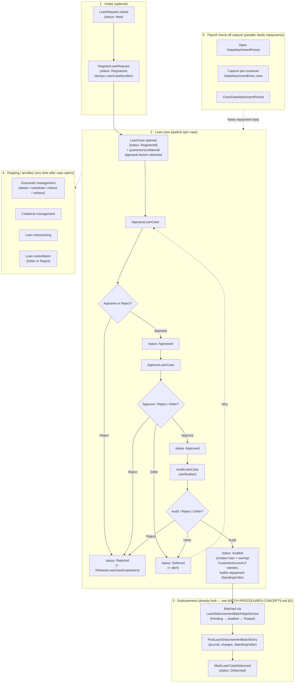
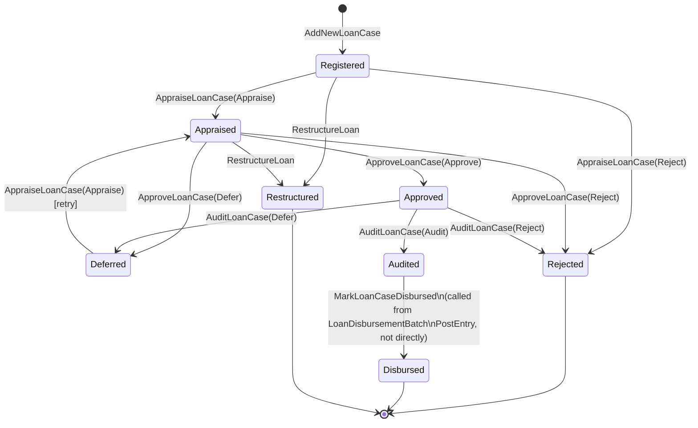
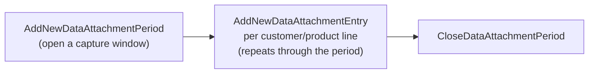

# Back Office — Functional Workflow

Audience: anyone about to adapt the `BackOfficeModule` app services into a
`WebApplication1` API surface (no controllers exist yet — see §9) who needs
to understand *what the back office is supposed to do*, not just what one
app-service method returns. This is a functional/process reference, not an
API spec — there is no `docs/api/*.md` for this module yet either; write one
alongside the first controller, following the pattern in
`docs/api/batch-procedures-api-spec.md`.

Source of truth:
- Functional design: reference MVC app,
  `SwiftFinancials.Web/Areas/Loaning/{Controllers,Views}/*` (read-only,
  sibling checkout — see root `CLAUDE.md`). Note the reference app calls
  this Area "Loaning", not "Back Office" — see §1.
- Domain aggregates: `Domain.MainBoundedContext/BackOfficeModule/Aggregates/*`.
- App services: `Application.MainBoundedContext/BackOfficeModule/Services/*`.
- DTOs: `Application.MainBoundedContext.DTO/BackOfficeModule/*`.
- The one piece already adapted: `Application.MainBoundedContext/BackOfficeModule/Services/LoanDisbursementBatchAppService.cs`
  → `WebApplication1/Areas/Accounts/Controllers/LoanDisbursementBatchController.cs`
  (documented in `Areas/Accounts/BATCH-PROCEDURES-CONCEPTS.md` §2 and
  `docs/api/batch-procedures-api-spec.md` §6 — not duplicated here).
- Enums referenced throughout:
  `Infrastructure.Crosscutting.Framework/Utils/Enumerations.cs`
  (`LoanCaseStatus`, `LoanRequestStatus`, `LoanAppraisalOption`,
  `LoanApprovalOption`, `LoanAuditOption`, `LoanCancellationOption`).

## 1. What "Back Office" means here

`BackOfficeModule` is this codebase's own namespace for the **loan
origination pipeline**: request intake → loan case registration →
appraisal → approval → audit/verification → guarantor & collateral
management → disbursement, plus the payroll/check-off "data attachment"
capture that feeds employer-remitted loan repayments into the same
pipeline. The codebase's own permission model agrees with this scope —
`ModuleNavigationItem` has distinct `BackOfficeLoanAppraisal`/
`BackOfficeLoanApproval`/`BackOfficeLoanAudit` codes, separate from
`FrontOfficeLoanAppraisal`/etc.

Two naming traps worth calling out explicitly, so nobody rediscovers them
mid-build:

- **The reference MVC app does not have an `Areas/BackOffice` folder.** The
  same functionality lives under `Areas/Loaning` there — 23 controllers,
  listed in §9. `Areas/BackOffice` in this repo (this doc's location) is a
  new name choice, matching the domain/application-layer namespace rather
  than the reference app's Area name, since "Loaning" reads as a product
  name and "BackOffice" is what the rest of this codebase (enums,
  permissions) already calls it.
- **This is a different "back office" than the one `FrontOffice/WORKFLOW.md`
  §1 refers to.** That doc uses "back office" loosely, to mean
  `Registry`/`Admin` master data (customer records, products, company
  config) — nothing to do with loans. This doc's "Back Office" is the
  `BackOfficeModule` bounded context specifically. Don't conflate the two
  when cross-referencing.

## 2. End-to-end functional map

## 3. Actors

| Actor | Role |
|---|---|
| Loan officer / registrar | Opens the `LoanCase` (`LoanRegistration` screen in the reference app), attaches guarantors/collateral |
| Appraiser | Runs `AppraiseLoanCase` — income/affordability assessment, appraisal factors, income adjustments |
| Approver | Runs `ApproveLoanCase` — the maker-checker gate on the appraiser's recommendation |
| Auditor / verifier | Runs `AuditLoanCase` — the final verification gate before a case is eligible for disbursement; this is the step that actually creates the customer's loan/savings accounts and repayment schedule |
| Batch maker/checker/approver | Same three-role segregation as every other Batch Procedures type — see `BATCH-PROCEDURES-CONCEPTS.md` §1 — applied to `LoanDisbursementBatch` |
| Payroll/data-capture clerk | Opens/closes `DataAttachmentPeriod`s and enters employer check-off deduction data per customer |
| Customer | Optionally raises a `LoanRequest`; is the subject of appraisal/approval/audit; provides guarantors/collateral |

## 4. Loan case status — the core state machine

`LoanCaseStatus`: `Registered`, `Appraised`, `Approved`, `Disbursed`,
`Rejected`, `Deferred`, `Audited` (UI label "Verified"), `Restructured`.

All four transition methods (`AppraiseLoanCase`, `ApproveLoanCase`,
`AuditLoanCase`, `MarkLoanCaseDisbursed`) live on `ILoanCaseAppService` /
`LoanCaseAppService.cs`, driven by their own option enums
(`LoanAppraisalOption{Appraise,Reject}`,
`LoanApprovalOption{Approve,Reject,Defer}`,
`LoanAuditOption{Audit,Reject,Defer}`). `CancelLoanCase` is a separate exit
path, gated by `LoanCancellationOption{Defer,Reject}`, available while a
case is still in an eligible pre-disbursed state.

**A shortcut exists**: if `LoanRegistration.BypassAudit` is set,
`ApproveLoanCase` auto-chains straight into `AuditLoanCase` — a case can go
Appraised → Audited in one call, skipping the audit step as a distinct
human action. Worth surfacing in a future controller/UI (e.g. as a flag on
the approve response) rather than silently happening.

**Known latent bug, not yet fixed** (found while reading
`LoanCaseAppService`, same audit discipline used elsewhere in this repo —
see the Voucher/General Ledger and InterAccountTransferBatch corrections in
`BATCH-PROCEDURES-CONCEPTS.md`): the guard-clause pattern in
`AppraiseLoanCase`/`ApproveLoanCase`/`AuditLoanCase`/`MarkLoanCaseDisbursed`
is `persisted.Status = (int)ExpectedPriorStatus; if (persisted.Status ==
(int)ExpectedPriorStatus) { ... }` — i.e. the code force-sets the *expected*
prior status onto the just-fetched entity immediately before checking it,
so the check is tautologically always true. In practice this means, e.g.,
`AuditLoanCase` never actually verifies the case is `Approved` before
auditing it — a case in almost any status could be pushed straight to
`Audited`. This mirrors the exact shape of the real bug already fixed in
`InterAccountTransferBatchController`'s history (force-set-before-check).
Flag this to product/backend before or while building the appraisal/
approval/audit controllers; the state machine described above is the
*intended* design, this bug is a gap between intent and enforcement, not a
reason to doc a different design.

## 5. Loan request intake (optional pre-case stage)

`LoanRequestStatus`: `New → Registered` (once a `LoanCase` is opened
against it — `RegisterLoanRequest` stamps `LoanCaseNumber` on the request)
or `New → Rejected` (`CancelLoanRequest`). Purely an "expression of
interest" record; a `LoanCase` can also be opened directly without one.

## 6. Appraisal

`AppraiseLoanCase` (`Registered`/`Deferred` → `Appraised` or `Rejected`).
Backed by `UpdateLoanAppraisalFactors` (the appraisal worksheet line items)
and `IIncomeAdjustmentAppService` (allowance/deduction catalogue entries
used to compute adjusted income during appraisal —
`IncomeAdjustmentType{Allowance,Deduction}`). Reference screen:
`AppraiseLoanController` — has its own income-adjustment lookup and
appraisal-factor add/remove sub-actions, plus a print/confirmation step.

## 7. Approval

`ApproveLoanCase` (`Appraised` → `Approved`/`Rejected`/`Deferred`) — a
straightforward maker-checker gate on the appraiser's recommendation, no
sub-resources of its own. Reference screen: `ApproveLoanController`.

## 8. Audit / verification

`AuditLoanCase` (`Approved` → `Audited`/`Rejected`/`Deferred`) — the
consequential step: this is where the customer's loan and savings
`CustomerAccount`s get created (if they don't already exist), charges/
present-value/payment amounts get computed, and the repayment
`StandingOrder` gets built or updated. Everything downstream (disbursement
batching) depends on a case reaching `Audited`. Reference screen:
`LoanVerificationController` (named "Verify" in the reference UI, "Audit" in
the app-service method name — same step, see the equivalent status-label
mismatch noted for `AccountClosureRequestAppService` in
`Areas/FrontOffice/WORKFLOW.md` §9).

## 9. Guarantors and collateral

Guarantor management is the single largest sub-surface, split across seven
methods on `ILoanCaseAppService`:

| Method | Purpose | Reference screen |
|---|---|---|
| `AddNewLoanGuarantor` / `UpdateLoanGuarantors` | Attach guarantors when opening/editing a case | `LoanRegistrationController`, `GuarantorManagementController` |
| `AttachLoanGuarantors` | Attach a guarantor's own account as security | `AttachGuarantorController` |
| `SubstituteLoanGuarantors` | Swap one guarantor for another mid-case | `GuarantorSubstitutionController` |
| `RelieveLoanGuarantors` | Release a guarantor's obligation (e.g. loan paid down enough) | `GuarantorRelievingController` |
| `ReleaseLoanGuarantors` / `ReleaseRefinancedLoanGuarantors` | Bulk release, incl. on rejection (§4) or refinance | Called internally from `AppraiseLoanCase`/`ApproveLoanCase` reject paths, and from restructuring |
| `RemoveLoanGuarantors` | Hard removal | `LoanGuarantorController` |

`GuarantorAttachmentController` in the reference app manages an attachment
*history* trail (`LoanGuarantorAttachmentHistoryAgg`), separate from the
live attach/relieve actions above.

`UpdateLoanCollaterals` (single method) covers collateral attach/edit —
reference screen `AddCollateralController`.

## 10. Restructuring and cancellation

`RestructureLoan` — reference screen `LoanRestructuringController`,
produces status `Restructured`. `CancelLoanCase` — reference screen
`LoanCancellationController`, exits to `Deferred` or `Rejected` per
`LoanCancellationOption`. Neither has been read in as much depth as the
core appraise/approve/audit path above; confirm exact pre/post-conditions
against `LoanCaseAppService` directly before building their controllers,
same discipline as §4's bug-finding.

## 11. Disbursement

Already built — see `Areas/Accounts/BATCH-PROCEDURES-CONCEPTS.md` §2 and
`docs/api/batch-procedures-api-spec.md` §6 for the full batch
Origination/Verification/Authorization flow, and
`Areas/Accounts/Controllers/LoanDisbursementBatchController.cs` for the
live controller. Not duplicated here; the one fact worth repeating in this
doc's context: an entry can only be added to a batch if its `LoanCase` is
already `Approved`/`Audited` and not yet batched, and posting an entry ends
with `MarkLoanCaseDisbursed`, closing the loop back into §4's state
machine.

## 12. Payroll / check-off data capture

A parallel track that feeds employer-remitted loan repayment data into the
system, independent of any single `LoanCase`'s appraisal state:

Reference screens: `DataCaptureController` (open/edit period),
`DataProcessingController` (per-customer entry capture, with customer/
customer-account lookups), `ClosingController` (close), `CatalogueController`
(browse captured entries). `FindCurrentDataAttachmentPeriod` (and a cached
variant) resolve "the currently open period" for the capture screen without
requiring the caller to track a period ID. This is what later shows up as
`CheckOff`-type entries in `CreditBatchAppService` (per
`BATCH-PROCEDURES-CONCEPTS.md` §2's Credit row) — not itself a loan-case
transition, but the upstream data source for one.

## 13. Reference-data catalogues

Three simple lookup CRUD services, no workflow of their own — build as
plain CRUD controllers when their first consumer needs them, same pattern
as `LoanProductController`'s read-only list endpoint (`CLAUDE.md`,
"Controllers adapted so far"):

| Service | Backs | Reference screen |
|---|---|---|
| `ILoaningRemarkAppService` | Free-text remark catalogue attached to loan-case decisions | `LoaningRemarkController` |
| `ILoanPurposeAppService` | Loan purpose catalogue (why the loan is being taken) | `LoanPurposeController` |
| `IIncomeAdjustmentAppService` | Allowance/deduction catalogue used in appraisal (§6) | `IncomeAdjustmentsController` |

`LoanProductAppraisalController` (product-level appraisal budget config,
not case-level) and `RepaymentScheduleController` (schedule preview,
`InterestCalculationsService`-adjacent) exist in the reference app but sit
closer to `AccountsModule`/product config than to a `LoanCase`'s own
lifecycle — evaluate them against `LoanProductController` and the existing
`InterestCalculationsService.LoanRepaymentCalculator` respectively when
their turn comes, rather than assuming they belong under `Areas/BackOffice`.

## 14. Implementation status in this repo

Nothing in this module has a controller yet except the disbursement tail.
No `Areas/BackOffice` (or `Areas/Loaning`) folder exists in
`WebApplication1` before this doc — creating one is the first step of
building any of the rows below.

| Functional area | Reference MVC controller | This repo | Status |
|---|---|---|---|
| Loan request intake | `LoanRequestController` | — | Not built |
| Loan case registration | `LoanRegistrationController` | `Areas/BackOffice/Controllers/LoanCaseController.cs` | **Live** — see §14.1 |
| Appraisal | `AppraiseLoanController` | — | Not built |
| Approval | `ApproveLoanController` | — | Not built |
| Audit / verification | `LoanVerificationController` | — | Not built |
| Cancellation | `LoanCancellationController` | — | Not built |
| Restructuring | `LoanRestructuringController` | — | Not built |
| Collateral | `AddCollateralController` | — | Not built |
| Guarantor attach | `AttachGuarantorController`, `GuarantorManagementController` | — | Not built |
| Guarantor attachment history | `GuarantorAttachmentController` | — | Not built |
| Guarantor relieving | `GuarantorRelievingController` | — | Not built |
| Guarantor substitution | `GuarantorSubstitutionController` | — | Not built |
| Guarantor CRUD/search | `LoanGuarantorController` | — | Not built |
| Loan purpose catalogue | `LoanPurposeController` | — | Not built |
| Loaning remark catalogue | `LoaningRemarkController` | — | Not built |
| Income adjustment catalogue | `IncomeAdjustmentsController` | — | Not built |
| Loan product appraisal budget | `LoanProductAppraisalController` | — | Not built (see §13) |
| Data attachment period open/edit | `DataCaptureController` | — | Not built |
| Data attachment entry capture | `DataProcessingController` | — | Not built |
| Data attachment period close | `ClosingController` | — | Not built |
| Data attachment entry browse | `CatalogueController` | — | Not built |
| Repayment schedule preview | `RepaymentScheduleController` | — | Not built (see §13) |
| Loan reporting by status | `ReportsController` | — | Not built |
| **Disbursement batch** | `AuthorizeLoanBatchController` | `Areas/Accounts/Controllers/LoanDisbursementBatchController.cs` | **Live** — see §11 |

## 14.1 Loan case registration, as built

`LoanCaseController` (`ILoanCaseAppService`, existing) — full CRUD read
endpoints plus a `Create` that registers a new loan case with guarantors
and collateral in one call, and a guarantor eligibility lookup for the
registration screen. Unlike every controller built so far in the "Batch
Procedures" module, `AddNewLoanCase` itself does almost none of the real
business rules — it only rejects a duplicate in-process application for the
same customer/product and persists whatever `LoanCaseDTO` it's handed.
Every other rule the reference `LoanRegistrationController` enforces (the
~40-field loan-product-at-registration-time snapshot, minimum/maximum
guarantor counts, self-guarantee permission, guarantor share sufficiency,
the minimum-membership-period gate) lives in the reference *controller*
itself, a session/TempData-driven MVC wizard — so it had to be reproduced
here rather than assumed to already exist server-side, the same lesson
`BATCH-PROCEDURES-CONCEPTS.md` §5 already learned the hard way ("a DTO's
fields are not proof of behavior in this codebase" generalizes to "an app
service's existence is not proof it enforces the rules its callers assume
it does").

Two corrections made against the reference, not just ported forward:

- Guarantor share values (`TotalShares`/`CommittedShares`/`AppraisalFactor`)
  are computed server-side from real data (customer accounts,
  `FindLoanGuarantorsByCustomerId`, `GetGuarantorAppraisalFactor`) rather
  than trusted from the request body — same reasoning as the
  `InterAccountTransferBatch` `AvailableBalance` fix. This also means
  `LoanGuarantorDTO`'s own `ValidateAmountGuaranteed` validator (which
  correctly multiplies `TotalShares` by `AppraisalFactor`) is what actually
  gates a guarantor here — the reference controller's manual check never
  applied the appraisal factor at all, a real gap in the reference, not a
  simplification worth keeping.
- The reference `Create` action calls `loanCaseDTO.ValidateAll();` and then
  never checks `HasErrors` — every one of `LoanCaseDTO`'s `CustomValidation`
  rules (security sufficiency, amount-applied range, retirement age, budget
  balance) silently runs and is silently discarded. `LoanCaseController`
  checks `HasErrors` and returns 400 with the real messages instead.

**Real bug found and fixed in `LoanCaseAppService.UpdateLoanCaseAsync`
itself** (not just the controller): two lines immediately after the method
already restores `persisted.CreatedDate` to its original value re-stamped
it to `DateTime.UtcNow` right back, and unconditionally set `CancelledBy`
on every plain update — not just cancellations. Both lines directly
contradicted the method's own preceding comment ("Restore original values
that were overwritten") and were removed. Same class of bug as
`JournalReversalBatch`'s `UpdateJournalReversalBatch` fix elsewhere in this
codebase.

Deliberately not reproduced: `GetDocumentsAsync`'s raw ADO.NET query
against `swiftFin_SpecimenCapture` for passport/signature/ID photos, and
`LoaneeLookup`'s `MessageBox.Show(Form.ActiveForm, ...)` call — genuine
`System.Windows.Forms` code that cannot execute in a web request pipeline
at all, dead in the reference app's own web context. `LoaneeLookup`'s
composite "customer 360" view (standing orders, payouts, in-process loan
applications) was also not reproduced as a bespoke aggregate endpoint —
every piece already has (or, for in-process applications, now has here —
`GET .../customers/{customerId}/in-process`) its own real endpoint;
composing them again here would just duplicate
`StandingOrderController`/`CreditBatchController`.

Scope decision: `BranchId` is supplied by the caller on the request body,
not resolved server-side from "the current user's branch" — the reference
did that via `ApplicationUserManager` (ASP.NET Identity, MVC-only), and no
Web API controller in this repo performs that lookup today. Branch
budget-balance validation is left unpopulated, matching the reference
`Create` action's own behavior — real budget balance computation is
`IBudgetAppService`'s job, out of scope here.

Suggested build order, following this doc's own dependency chain: loan
request intake (§5) and reference-data catalogues (§13, needed by every
downstream screen's pickers) first, then case registration + guarantor/
collateral attach (§9-10, needed to have a case to appraise), then
appraise → approve → audit (§6-8, the core pipeline — fix or at least flag
the §4 guard-clause bug while here), then cancellation/restructuring (§10),
then data attachment capture (§12) and the catalogue/reporting tail. Each
new app service, once wired into `WebApplication1`, also needs Unity
registration in both `WebApplication1/App_Start/UnityConfig.cs` and
`DistributedServices.MainBoundedContext/UnityContainers/Container.cs`, and
its `.cs` file added to the relevant old-style `.csproj` — see root
`CLAUDE.md`'s "Adapting a controller" workflow, unchanged for this module.
