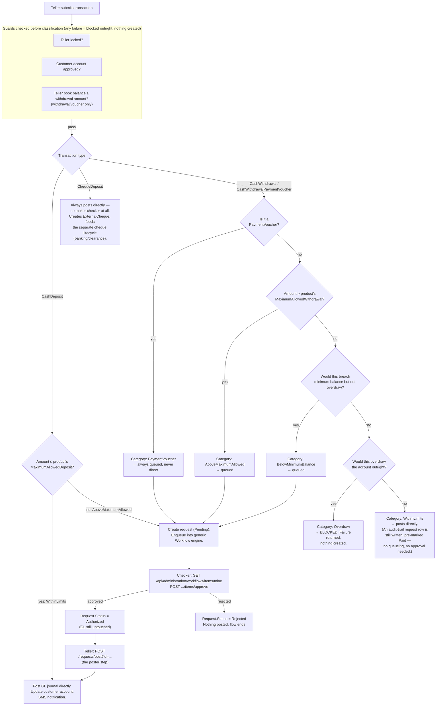

# Savings Receipts/Payments — Transaction Flow

"Savings Receipts/Payments" is the reference app's own menu label
(`NavigationMenu.cs`, Front-Office → Operations → Teller) for one screen:
`CashDepositController` (`POST /api/frontoffice/requests`, see
`docs/api/frontoffice-api-spec.md` §4). One endpoint, one `FrontOfficeTransactionType`
parameter, four behaviors:

| `Type` | Meaning |
|---|---|
| `2` CashDeposit | Customer pays cash in |
| `1` CashWithdrawal | Customer takes cash out |
| `3` ChequeDeposit | Customer deposits a cheque |
| `4` CashWithdrawalPaymentVoucher | Withdrawal settled by voucher instead of cash |

Source: `WebApplication1/Areas/FrontOffice/Controllers/CashDepositController.cs`,
`ProcessCustomerTransactionAsync`.

## The one question that matters: does approval post the transaction?

**No.** Approving a request only flips its status to `Authorized` —
`CashDepositRequestAppService.AuthorizeCashDepositRequest`/
`CashWithdrawalRequestAppService.AuthorizeCashWithdrawalRequest` update
`Status`, `AuthorizedBy`, `AuthorizedDate` and stop there; neither touches
the GL. **The teller has to come back and explicitly post it** — either by
calling `POST /api/frontoffice/requests/post?id={requestId}`, or by
resubmitting the same transaction through `POST /` with the request's id
attached, which re-derives the journal and posts it. Until that happens, an
`Authorized` request just sits there — approved, but no money has moved.

This is a genuine three-role split, not a two-step approval:

1. **Maker** (teller) — enters the transaction.
2. **Checker** (supervisor, via the generic workflow inbox) — approves or
   rejects the *request*.
3. **Poster** (teller, back at the counter) — pulls the now-`Authorized`
   request and actually posts it.

## Classification — what decides "within limits" vs. not

## Classification rules, precisely

| Category | Condition | Outcome |
|---|---|---|
| **Deposit — WithinLimits** | `TotalValue ≤ Product.MaximumAllowedDeposit` | Posts directly |
| **Deposit — AboveMaximumAllowed** | `TotalValue > Product.MaximumAllowedDeposit` | Queued for approval |
| **Withdrawal — WithinLimits** | Passes every check below | Posts directly |
| **Withdrawal — AboveMaximumAllowed** | `TotalValue > Product.MaximumAllowedWithdrawal` | Queued |
| **Withdrawal — BelowMinimumBalance** | Withdrawal + customer-borne charges would dip below available balance, but total (incl. all charges) still fits within available balance + product minimum balance | Queued |
| **Withdrawal — Overdraw** | Withdrawal + charges exceeds available balance + product minimum balance | **Blocked outright** — no request created, no queue, just a failure message |
| **Withdrawal/Voucher — PaymentVoucher** | `Type == CashWithdrawalPaymentVoucher` | Always queued, regardless of amount |
| **Cheque deposit** | n/a | Always posts directly (no maker-checker) |

Checked *before* any of the above, and blocking outright if failed:
- Teller is locked (`Teller.IsLocked`).
- Customer account isn't `Approved`.
- For withdrawals/vouchers: teller's GL book balance is less than the
  amount requested (the till doesn't physically have the cash) — this is
  checked before category classification even runs.

Note what's conspicuously **not** a limit check here: nothing in this flow
enforces `Teller.RangeLowerLimit` for deposit/withdrawal (unlike the
cheque-deposit and treasury/EOD paths, which do check it) — worth
confirming with product/business whether that's intentional or a gap, since
every other cash-affecting flow in the front office enforces it.

## What "posts directly" actually does

1. `AddNewJournal(...)` — double-entry GL posting (debit/credit chart of
   accounts derived from teller + product wiring).
2. `UpdateCustomerAccount(...)` — refreshes the customer account's balance.
3. If this was posting an already-`Authorized` queued request, that
   request is marked `Posted` (deposit) / `Paid` (withdrawal) at the same
   time — the poster step and the "mark it done" step are the same call.
4. An SMS is sent to the customer (`SendTextNotificationAsync`) if their
   phone number is present and E.164-shaped — for deposits, withdrawals,
   and cheque deposits alike.
5. The response's `data` is the full `JournalDTO` — that's what a receipt
   gets rendered from client-side (see `docs/api/frontoffice-api-spec.md`
   §4.2 and §11 of `WORKFLOW.md` — there is no server-side printing).

## What "queued" actually does

1. A `CashDepositRequestDTO`/`CashWithdrawalRequestDTO` is created with
   `Status = Pending`.
2. A generic `Workflow` row is enqueued
   (`SystemPermissionType.CashDepositRequestAuthorization` /
   `CashWithdrawalRequestAuthorization`), with `RequiredApprovals` set from
   however many approvers the configured role(s) need.
3. Nothing is posted. The teller's screen gets back
   `{ success: false, data: { dialog: true, cashTransactionRequestId, ... } }`
   — meant to show a "submitted for approval" dialog, not an error.
4. A checker with the right role sees it in
   `GET /api/administration/workflows/items/mine` and approves/rejects via
   `POST /api/administration/workflows/items/approve`. This is a generic
   engine shared with every other maker-checker flow in the system (account
   verification, expense payables, etc.) — not something specific to this
   screen.
5. Approval → `Authorized`. **Still not posted.** Rejection → `Rejected`,
   flow ends, nothing posted, ever.
6. Only when a teller explicitly calls `POST /requests/post?id={requestId}`
   does the system re-derive the transaction from the request and actually
   post the journal (step "What 'posts directly' actually does" above, and
   the request itself flips to `Posted`/`Paid` in the same call).

There's also `POST /requests/markposted?id={requestId}` — flips an
`Authorized` request straight to `Posted`/`Paid` *without* posting a new
journal. That's a status-correction escape hatch (use if the journal was
already posted through some other path), not the normal flow — normal
flow is always `POST /requests/post`.
