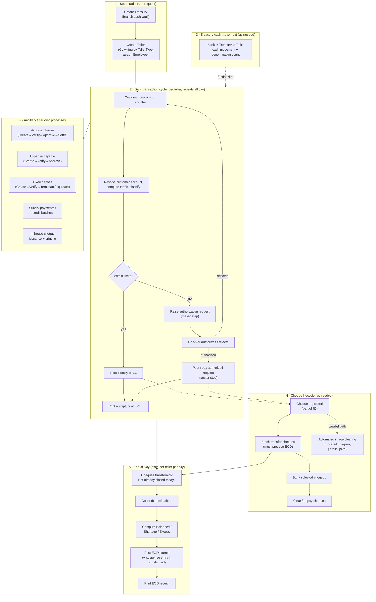
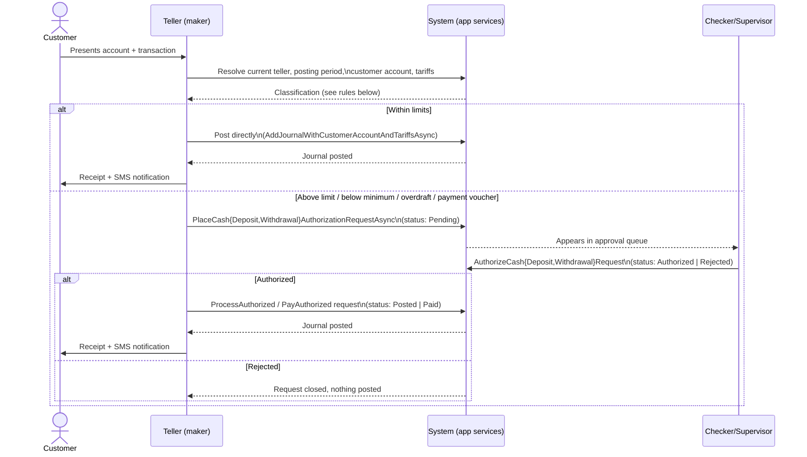
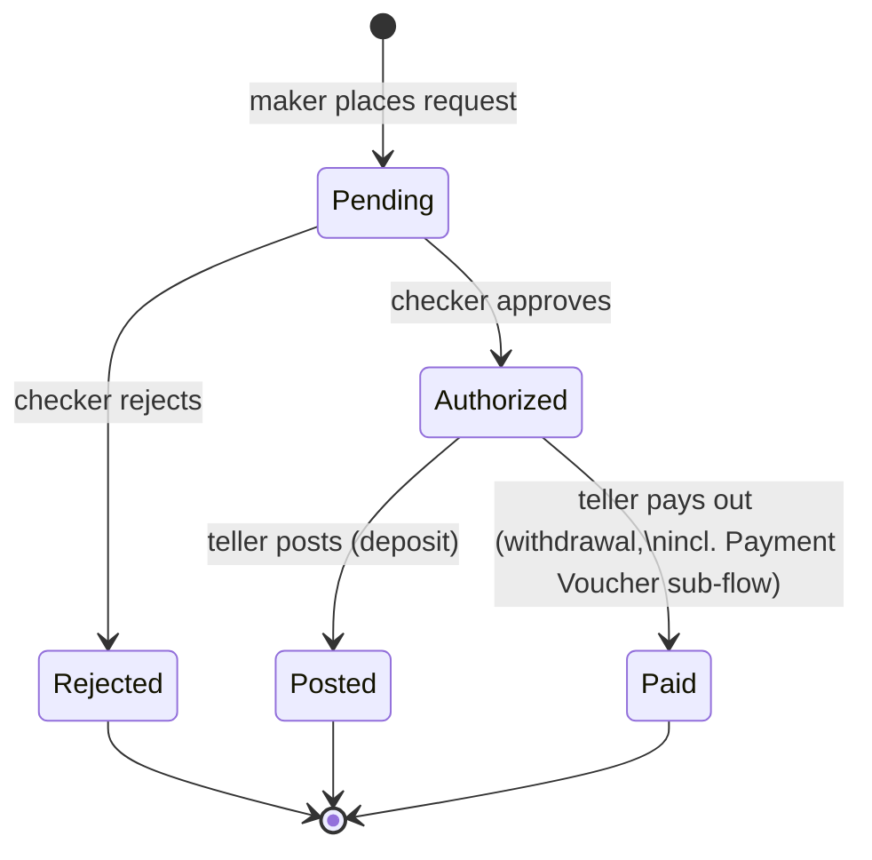
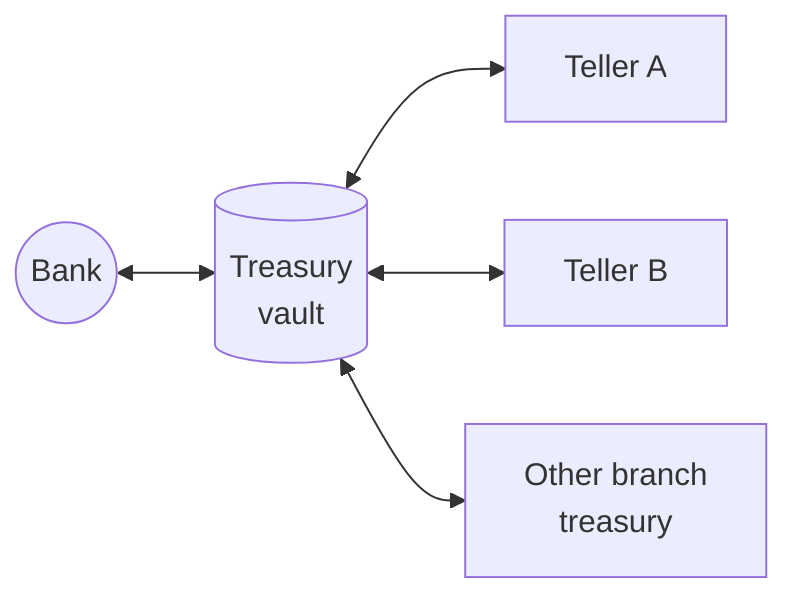
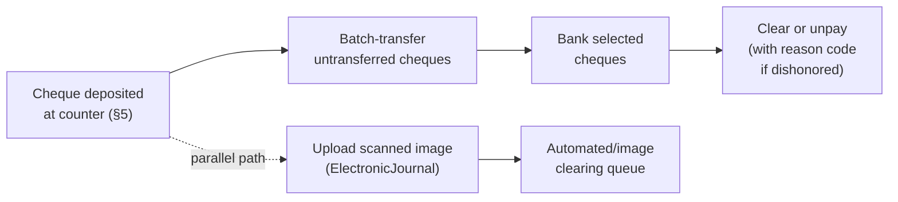
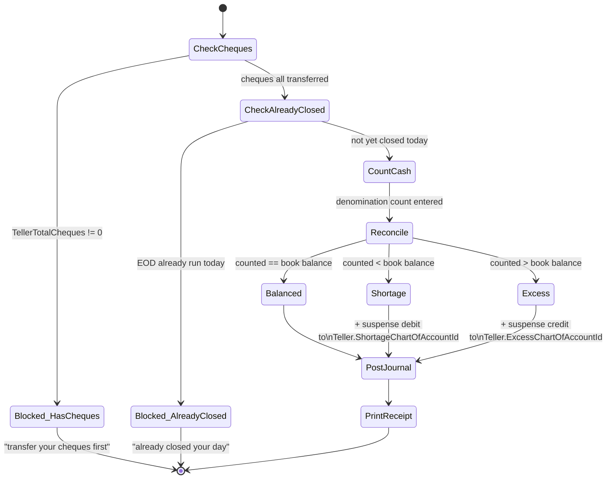

# Front Office — Functional Workflow

Audience: anyone building or reviewing the `Areas/FrontOffice` API surface
who needs to understand *what the front office is supposed to do*, not just
what one endpoint returns. This is a functional/process reference, not an
API spec — see `docs/api/*.md` (once written, see §10) for request/response
shapes.

Source of truth:
- Functional design: reference MVC app,
  `SwiftFinancials.Web/Areas/FrontOffice/{Controllers,Views}/*` (read-only,
  sibling checkout — see root `CLAUDE.md`).
- Domain aggregates: `Domain.MainBoundedContext/FrontOfficeModule/Aggregates/*`
  and `Domain.MainBoundedContext/AccountsModule/Aggregates/TellerAgg/Teller.cs`.
- App services: `Application.MainBoundedContext/FrontOfficeModule/Services/*`.
- This repo's API controllers: `WebApplication1/Areas/FrontOffice/Controllers/*`.
- Enums referenced throughout:
  `Infrastructure.Crosscutting.Framework/Utils/Enumerations.cs`.

## 1. What "Front Office" means here

Everything that touches **physical/counter cash or cheques and their GL
posting**: a teller taking a deposit or paying out a withdrawal, treasury
moving cash to/from the bank and out to tellers, cheques being banked and
cleared, and the daily till close-out. This is distinct from the
`Registry`/`Admin` back-office modules (customer records, products, company
config) already documented elsewhere in `CLAUDE.md`.

There is **no separate "front office session" concept** (no login-to-till,
no explicit open-till action). A teller is a standing GL-linked identity
(`Teller` aggregate); anyone assigned to it can transact against it every
day until it is administratively locked, and the *day* boundary is enforced
by the End of Day process (§8), not by a session object.

## 2. End-to-end functional map

## 3. Actors

| Actor | Role |
|---|---|
| Teller | Maker — enters transactions at the counter, holds a GL-linked `Teller` identity |
| Supervisor / checker | Authorizes above-limit deposits, withdrawals, transfers, EOD variances go to suspense automatically (no separate approval) |
| Treasury officer | Moves cash between bank, vault (treasury), and tellers |
| Back-office verifier/approver | Second/third maker-checker stage on account closure and expense payables (distinct from the teller's own checker) |
| Customer | Initiates deposits, withdrawals, cheque deposits, account closure requests |

## 4. Teller & till model

`Teller` (`Domain.MainBoundedContext/AccountsModule/Aggregates/TellerAgg/Teller.cs`)
is the only real invariant-bearing object here:

- `Type` (`TellerType`: InhousePointOfSale / ATM / AgentPointOfSale) drives
  which chart-of-account the till's cash is wired to at creation time.
- `ChartOfAccountId` — the till's cash GL account.
- `ShortageChartOfAccountId` / `ExcessChartOfAccountId` — suspense accounts
  that automatically absorb EOD variances (§8).
- `Range` — a lower-limit value object; any deposit/withdrawal that would
  push the till's book balance below `RangeLowerLimit` is blocked outright.
- `IsLocked` (`Lock()` / `UnLock()`) — a locked teller cannot post anything;
  every transaction path checks this before touching the GL account.

There is no "open till for the day" step — a teller is simply available
(not locked) or not. The daily boundary is entirely owned by whether
`IsEndOfDayExecutedAsync` has already run for that teller today (§8).

## 5. Core transaction cycle — deposit / withdrawal / cheque deposit

One screen (old repo: `CashDepositController.Create`; this repo: unified
`CashDepositController` under `api/frontoffice/requests`) handles all three
transaction types via `FrontOfficeTransactionType`
(`CashDeposit`, `CashWithdrawal`, `ChequeDeposit`, `CashWithdrawalPaymentVoucher`).

**Classification rules** (enforced in the transaction-posting code, not as
named domain methods):

| Transaction | Blocked outright when | Requires authorization (maker-checker) when | Posts directly when |
|---|---|---|---|
| Cash deposit | Teller is locked | Amount > product's maximum allowed deposit (`CashDepositCategory.AboveMaximumAllowed`) | Amount ≤ product maximum (`WithinLimits`) |
| Cash withdrawal | Teller book balance < amount (till doesn't have the cash); would breach `Teller.RangeLowerLimit` | Above product maximum, below customer minimum balance, would overdraw, or is a payment voucher (`AboveMaximumAllowed`/`BelowMinimumBalance`/`Overdraw`/`PaymentVoucher`) | Within product limits and doesn't breach minimum balance (`WithinLimits`) |
| Cheque deposit | — | — | Always posts directly; creates `ExternalCheque` + `ExternalChequePayable`, then feeds the cheque lifecycle (§7) |

`CashDepositRequestAuthStatus` / `CashWithdrawalRequestAuthStatus` are the
underlying state machines behind the "requires authorization" branch:

A payment-voucher withdrawal is a distinct posting path
(`PayCashWithdrawalRequestAsync` with a validated `PaymentVoucherDTO`)
rather than a straight cash payout — used when the withdrawal is settled by
issuing a voucher instead of physical cash.

## 6. Treasury cash movement

Treasury (`Treasury` aggregate — the branch's cash vault) moves cash in four
directions, all through one screen (`CashManagementController.Create`,
`TreasuryTransactionType`): `BankToTreasury`, `TreasuryToBank`,
`TreasuryToTeller`, `TreasuryToTreasury`. Outgoing transfers are blocked if
`ActiveTreasury.BookBalance` is insufficient. Every movement — and every EOD
close (§8) — is recorded with a **denomination breakdown**
(`FiscalCountDTO`: 1000/500/200/100/50/40/20/10/5/1/50-cent note+coin
counts), not just a total, so physical cash counted at the counter can be
reconciled against the GL figure.

## 7. Cheque lifecycle

A teller **cannot close their day** (§8) while they still hold untransferred
cheques — the transfer batch step is a hard EOD precondition, not optional
housekeeping.

## 8. End of Day close

The one real state machine in the front office, enforced in order:

Shortages/excesses are posted automatically to the teller's own dedicated
suspense GL accounts — there is no manual out-of-band adjustment step for an
unbalanced till.

## 9. Ancillary / periodic processes

These sit in the same area but run far less often than the daily cycle, and
each has its own multi-stage maker-checker shape:

| Process | Stages | Purpose |
|---|---|---|
| Account closure | Create → **Verify** → Approve → **Settle** | Pays out remaining balance and closes a customer account (4 stages — the only front-office flow with a distinct verify *and* approve step, plus a final settlement) |
| Expense payable | Create → Verify → Approve | Petty-cash / expense voucher with multiple GL lines (header + entries pattern) |
| Fixed deposit | Create → Verify → **Terminate** (early, batch-capable) or **Liquidate** (at maturity, batch-capable) | Counter-originated fixed deposit product lifecycle |
| Sundry payments / credit batches | Single-stage entry | General GL voucher postings; also surfaces `CreditBatchType.Payout`/`CheckOff` batch entries (e.g. payroll check-off) |
| Customer receipts | Single-stage entry | Free-form multi-line GL receipt/voucher not tied to a specific account transaction type |
| In-house cheque | Build batch → Print preview → Print | SACCO-issued outward cheques (e.g. loan disbursement payouts), with payee/GL-account lookups and a PDF cheque template |

## 10. Implementation status in this repo

| Functional area | Old MVC controller (reference) | This repo | Status |
|---|---|---|---|
| Teller master data | `TellerController` | `Areas/FrontOffice/Controllers/TellerController.cs` | Live — `[AllowAnonymous]`, wildcard CORS, delete unimplemented |
| Deposit/withdrawal transaction + request queue | `CashDepositController`, `CashWithdrawalController`, `CashWithdrawalRequestController` | `Areas/FrontOffice/Controllers/CashDepositController.cs` (unified) | Live — most recently touched by `b2ec977` (posting/state-transition bug fixes) |
| — dead duplicate | `CashWithdrawalController` | `Areas/FrontOffice/Controllers/CashWithdrawalController.cs` | **Fully commented out**, not compiled — superseded by the unified controller above; flag before deleting per root `CLAUDE.md`'s "don't delete without confirming nothing depends on it" guidance |
| Treasury cash movement | `CashManagementController` | `Areas/FrontOffice/Controllers/CashManagementController.cs` | Live |
| Treasury master data | `TreasuryController` | `Areas/FrontOffice/Controllers/TreasurysController.cs` | Live |
| Cash transfer requests + cheque transfer batch | `CashTransferController`, `TransfersController` | `Areas/FrontOffice/Controllers/TransfersController.cs` (both folded in) | Live |
| Cheque banking & clearance | `ChequesController` | `Areas/FrontOffice/Controllers/ChequesController.cs` | Live |
| End of day close | `EndOfDayController` | `Areas/FrontOffice/Controllers/EndOfDayController.cs` | Live — `PrintReceipt` still uses `System.Drawing.Printing`/hardcoded printer name, meaningless server-side (see §11) |
| Automated/image cheque clearing | `AutomatedClearingController` | — | Not ported |
| Account closure | `AccountClosureController` | — | Not ported |
| Expense payable | `ExpensePayableController` | — | Not ported |
| Fixed deposit | `FixedDepositController` | — | Not ported |
| Sundry payments / credit batches | `SundryPaymentsController` | — | Not ported |
| Customer receipts | `CustomerReceiptsController` | — | Not ported |
| In-house cheque issuance/printing | `InHouseController` | — | Not ported |
| Standalone fiscal count CRUD | `FiscalCountController` | — | Not ported (denomination counting still works inline via `FiscalCountDTO` on treasury/EOD posts) |

Domain aggregates and app services for every row above already exist,
byte-identical to the old repo, under `Domain.MainBoundedContext/FrontOfficeModule`
and `Application.MainBoundedContext/FrontOfficeModule/Services` — the "not
ported" rows are purely missing `ApiController`s, not missing business logic.

## 11. Known gaps worth flagging

- **No `docs/api/*.md` spec exists yet for any front-office endpoint**,
  despite 7 controllers being live and two of the most recent commits
  touching this area. Once endpoint shapes stabilize, write
  `frontoffice-*-api-spec.md` docs following the pattern in
  `docs/api/textalert-api-spec.md`, and add them to `docs/api/README.md`.
- `EndOfDayController.PrintReceipt` (and `CashDepositController`'s receipt
  printing) still build a plain-text receipt and drive
  `System.Drawing.Printing.PrintDocument` against a hardcoded local printer
  name (`"EPSON L3250 Series"`) — this was a same-machine assumption valid
  for a desktop MVC app, but doesn't work from a server-side Web API. Needs
  a real design decision (return receipt data/PDF to the caller for
  client-side printing?) before it's relied on.
- Root `CLAUDE.md`'s "Controllers adapted so far" list doesn't mention any
  front-office controller — worth updating alongside whichever controller
  you touch next, since the list is meant to track what's been adapted.
