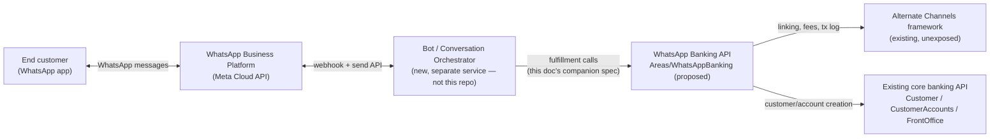
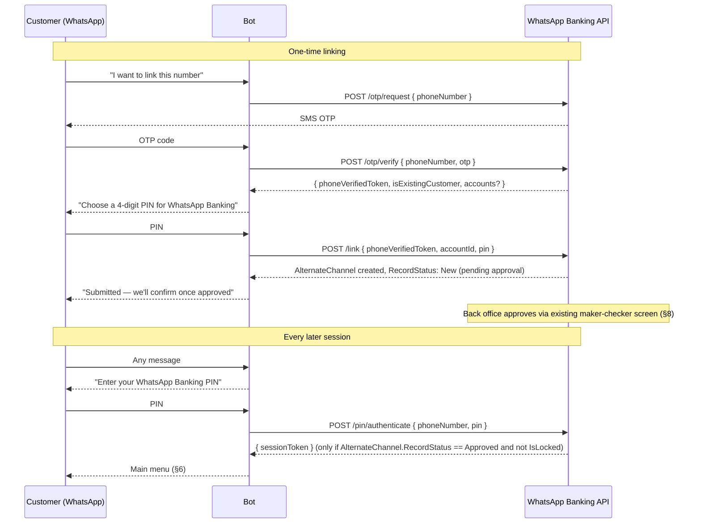
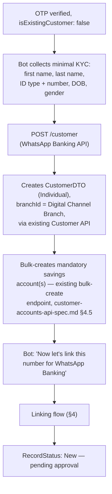
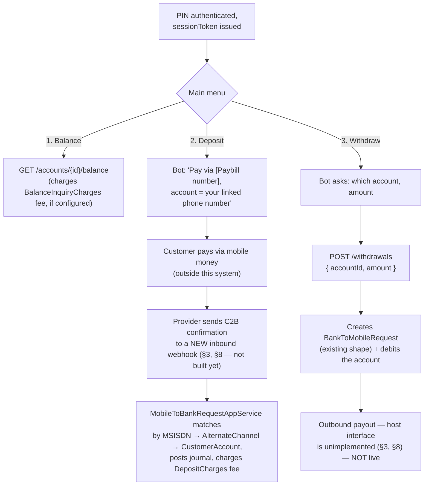

# WhatsApp Banking — Functional Workflow (Front Office Phase)

**Status: proposed design, nothing in `Areas/WhatsAppBanking` exists in code
yet.** Revision note: an earlier draft of this document designed channel
identity and money movement from scratch. Before that shipped, an existing
**Alternate Channels** module was found already living in this codebase
(`AlternateChannel`/`AlternateChannelLog`/`MobileToBankRequest`/
`BankToMobileRequest` — see §3) — the same problem this document solves,
already partially built for other channels (Sacco Link, Sparrow, M-Co-op
Cash, SpotCash, ...). This revision designs WhatsApp Banking as a new
channel on top of that framework instead of a parallel one. See §3 for what
that changes and §8 for what it doesn't solve on its own.

Audience: anyone building or reviewing the `Areas/WhatsAppBanking` API
surface, or building the WhatsApp bot/conversation layer that calls it.

Source of truth:
- Customer/account creation (reused as-is):
  `docs/api/customer-api-spec.md`, `docs/api/customer-accounts-api-spec.md`.
- Deposits/withdrawals (existing in-branch path, referenced for comparison):
  `docs/api/frontoffice-api-spec.md` §4.
- OTP delivery: `docs/api/textalert-api-spec.md`.
- **Alternate Channels framework (this revision's foundation)**:
  - Linking: `Domain.MainBoundedContext/AccountsModule/Aggregates/AlternateChannelAgg/AlternateChannel.cs`,
    `Application.MainBoundedContext/AccountsModule/Services/IAlternateChannelAppService.cs`.
  - Channel types/fees: `AlternateChannelType`, `AlternateChannelKnownChargeType`
    in `Infrastructure.Crosscutting.Framework/Utils/Enumerations.cs`.
  - Transaction log + reconciliation: `AlternateChannelLogAgg`,
    `AlternateChannelReconciliationPeriodAgg`/`...EntryAgg`.
  - C2B deposit matching: `Domain.MainBoundedContext/AccountsModule/Aggregates/MobileToBankRequestAgg/`,
    `Application.MainBoundedContext/AccountsModule/Services/MobileToBankRequestAppService.cs`.
  - B2C withdrawal queuing: `BankToMobileRequestAgg`,
    `BankToMobileRequestAppService.cs`, `SwiftFinancials.BankToMobileHostInterface`
    (the outbound host — **currently an empty, unimplemented project**).
  - Reference staff UI this pattern comes from: reference app
    `Areas/Accounts/Controllers/RegisterController.cs` (`Linking`, `Create`,
    `Edit`, `Verify`, `Authorize`, `History` actions).

## 1. What "WhatsApp Banking" means here, this phase

A self-service channel over WhatsApp. A member (or prospective member) chats
with the SACCO's WhatsApp Business number and, without visiting a branch or
talking to a teller, can:

1. Register as a customer, if they aren't one yet, and get a savings
   account opened.
2. Link their phone number as a **WhatsApp Banking alternate channel**
   against that account (§4) — a one-time step, subject to back-office
   approval, same as every other channel this system already supports.
3. Check balance / a mini-statement.
4. Deposit into an account.
5. Withdraw from an account.

**Explicitly out of scope this phase** (§7): loan application, anything
back-office/underwriting.

## 2. Actors & systems

- **End customer** — chats via WhatsApp, no app install.
- **WhatsApp Business Platform** — Meta's Cloud API. Not part of this
  codebase.
- **Bot / Conversation Orchestrator** — a new, separate service. Owns the
  conversation state machine, renders WhatsApp messages, calls the
  WhatsApp Banking API. Treated as **the frontend** in the companion spec.
- **WhatsApp Banking API** (`Areas/WhatsAppBanking`, proposed) — thin
  glue. Registers WhatsApp as a new `AlternateChannelType` and calls the
  existing `IAlternateChannelAppService`/`IMobileToBankRequestAppService`/
  `IBankToMobileRequestAppService` for everything channel-shaped; calls
  the existing Customer/CustomerAccounts controllers for onboarding.
- **Alternate Channels framework** (existing, this repo, currently
  unexposed by any controller) — owns channel linking, per-channel fees,
  and (for the money-movement pieces) C2B/B2C request logging. Detailed
  in §3.

## 3. Why this is a new `AlternateChannelType`, not a bespoke design

**What already exists, and is reused as-is:**

- **Linking** (`AlternateChannel` aggregate) — a per-`CustomerAccount`
  record: `Type` (channel), `CardNumber` (MSISDN for a mobile-style
  channel), `MobilePIN`, `DailyLimit`, `IsThirdPartyNotified`/
  `ThirdPartyResponse`, `IsLocked`, `RecordStatus`. Every existing channel
  (Sacco Link, Sparrow, M-Co-op Cash, ...) requires a customer to be
  **linked** before they can transact on it — a real record, a real
  approval step, not implicit.
- **Fees** (`AlternateChannelKnownChargeType`) — Linking, Replacement,
  Renewal, **Withdrawal, Deposit, Mini Statement, Balance Inquiry**,
  Airtime, **PIN Reset**, resolved per channel type via
  `IAlternateChannelAppService.FindCommissions(channelType, chargeType)`.
  Every fulfillment action below has a natural fee hook already built —
  no bespoke pricing model needed.
- **C2B deposit matching** (`MobileToBankRequest`) — real, working GL
  logic: given an M-Pesa-shaped Paybill confirmation (`MSISDN`,
  `BusinessShortCode`, `TransID`, `BillRefNumber`, `TransAmount`, ...), it
  matches to a `CustomerAccount` either by parsing an encoded account
  reference or **by `MSISDN` against the `AlternateChannel` link**
  (`FindAlternateChannelsByCardNumber` — this is exactly the WhatsApp
  linking record from above), then posts a real journal
  (Credit customer's product GL / Debit `MobileWalletC2BSettlement`).
  Unmatched requests queue for manual back-office reconciliation
  (`ReconcileMobileToBankRequest`/`AuditMobileToBankRequestReconciliation`).
- **B2C withdrawal queuing** (`BankToMobileRequest`) — a record shape +
  `IBrokerService.ProcessBankToMobileRequests` dispatch exists, intended
  to hand off to an outbound host process for the actual telco payout call.

**What's genuinely missing, confirmed by reading the code, not assumed:**

- No `WebApplication1` controller exists for **any** of this — same
  "fully built, WCF-only" shape as ChequeBook/UnPayReason before those got
  controllers. `AlternateChannelService.svc.cs`,
  `MobileToBankRequestService.svc.cs`, `BankToMobileRequestService.svc.cs`
  are the only current entry points.
- **No inbound REST webhook exists** for a provider (Safaricom or anyone)
  to actually call `AddNewMobileToBankRequest` with a live C2B
  confirmation. The matching/posting logic is real; nothing external can
  trigger it today.
- **`SwiftFinancials.BankToMobileHostInterface`** — the project that would
  make an outbound B2C call to actually pay a customer out — is an empty,
  unimplemented stub (checked directly: default `Class1.cs`, nothing
  else). `BankToMobileRequest` rows can be created and queued; nothing
  consumes that queue.
- No existing `AlternateChannelType` covers WhatsApp (or any generic
  mobile/chat channel) — this phase proposes adding one
  (`WhatsAppBanking`, next enum value after `Broker = 256`, i.e. `512`).

**Net effect on this design**: linking, fees, and deposit-matching reuse
real, existing logic — genuine leverage, not just a nicer diagram. The
inbound C2B webhook and the outbound B2C host are real, scoped backend
work this phase still needs to do; they are not solved by "just call the
existing service," because nothing external can reach it yet.

## 4. Identity — phone verification (OTP) + channel PIN (linking)

Two different mechanisms, used for two different things — this is the main
change from the previous draft, which used OTP for *every* session:

- **OTP** proves momentary control of a phone number. Used only at
  **linking time** (once) and for **PIN reset** (rare) — not on every
  chat session. Delivered by SMS via the existing `ITextAlertAppService`
  (`docs/api/textalert-api-spec.md`), same as before.
- **`MobilePIN`** (set once, during linking) is what authenticates
  **every subsequent transacting session** — the same convention every
  other `AlternateChannel` in this system already uses (this is precisely
  what the field is for). The bot prompts for it at the start of a
  balance/deposit/withdraw flow, not a fresh OTP each time.

- Linking is **self-service-initiated but not self-service-approved** —
  consistent with every existing channel, none of which let a customer
  activate themselves. This adds latency (§8) that in-branch linking
  doesn't have; that's a deliberate trade for not requiring a branch visit,
  not an oversight.
- `isExistingCustomer: false` at OTP-verify time routes into onboarding
  (§5) before linking is even possible — `AlternateChannel` is per-account,
  so a brand-new WhatsApp user needs an account to link *to* first.
- PIN storage/hashing, retry-lockout behavior (`AlternateChannel.IsLocked`
  already exists for this — how it gets set isn't designed here), and
  `DailyLimit` sourcing (customer-chosen vs. back-office-configured
  default) are open items — §8.

## 5. Flow: new customer — onboarding, then linking

Unchanged from the previous draft except it now flows straight into §4's
linking step rather than ending at "you're set up" — a new customer isn't
actually able to transact over WhatsApp until linking is approved, same as
an existing customer.

**Digital Channel Branch is still needed** — `AlternateChannel` doesn't
solve *where* a self-onboarded customer's `CustomerDTO.branchId` comes
from; that's a separate, still-open back-office setup dependency (§8),
unrelated to the Alternate Channels framework.

**KYC document capture** is still not designed here — unchanged open item.

## 6. Flow: returning, linked customer — balance, deposit, withdrawal

- **Fees**: balance, deposit, and withdrawal each look up
  `IAlternateChannelAppService.FindCachedCommissions(AlternateChannelType.WhatsAppBanking,
  chargeType)` (`BalanceInquiryCharges`/`DepositCharges`/
  `WithdrawalCharges`) and apply the resulting `Commission` the same way
  every other channel's transactions already do — not a new pricing
  concept, just a new lookup key.
- **Deposit is customer-funds-first, confirmation-driven** — the bot does
  not itself move money; it tells the customer how to pay (Paybill number
  + their linked phone as the account reference) and the *existing*
  `MobileToBankRequestAppService` matching/posting logic takes over once a
  confirmation arrives. **The inbound webhook that would receive that
  confirmation does not exist yet** — real, scoped work, not a design gap
  this document can resolve by itself. Until it's built, deposit
  can't go beyond "tell the customer how to pay" for a live provider.
- **Withdrawal creates a real `BankToMobileRequest`**, which is the
  correct domain shape, but **the process that actually pays the customer
  out doesn't exist** (`SwiftFinancials.BankToMobileHostInterface` is an
  empty stub). Until it's built, a withdrawal can debit the account and
  queue the request, but nothing disburses — this needs either that host
  built, or an interim manual/agent-redemption fallback, before this flow
  can go live. Flagged prominently, not glossed over.
- Debit posting for a withdrawal (the account-side leg,
  before the payout leg) can reuse `POST /api/frontoffice/requests`
  (`CashWithdrawal`) the same way the earlier draft proposed, if a faster
  interim "ledger moves, payout is manual" path is wanted while the real
  B2C host is built — a phasing decision, not designed further here.

## 7. Roadmap — Phase 2 (not designed yet)

Unchanged from the previous draft: loan application over this same channel
is the natural next step once customer/account/linking/deposit/withdrawal
is live and stable, but needs its own audit of the loan/underwriting domain
first — not part of this document.

## 8. Open design questions — confirm before implementation

1. **`AlternateChannelType.WhatsAppBanking` needs to actually be added**
   to the enum (proposed value `512`) and to whatever back-office screens
   list channel types (the reference `RegisterController`'s
   `GetAlternateChannelTypeSelectList`) — a small, mechanical change, but
   a real one.
2. **Self-service linking approval latency** — a new customer/number can't
   transact until back office approves the `AlternateChannel` link
   (`RecordStatus: New → Approved`). Is there an existing checker
   inbox/screen for this (the reference `RegisterController.Verify`/
   `Authorize` actions imply one), and what's an acceptable turnaround
   time for a customer waiting on WhatsApp? Needs a product answer.
3. **Inbound C2B webhook** — building a REST endpoint that a mobile money
   provider can call with a live payment confirmation, mapped to
   `MobileToBankRequestAppService.AddNewMobileToBankRequest`. This is the
   single highest-leverage piece of real backend work identified here —
   it's the deposit story not just for WhatsApp but for every channel that
   wants C2B deposits.
4. **Outbound B2C host** — `SwiftFinancials.BankToMobileHostInterface`
   needs an actual implementation (or a decision to route B2C payouts some
   other way) before self-service withdrawal payout works at all.
5. **PIN vs. OTP threat model** — is a 4-ish digit `MobilePIN`,
   authenticated over a bot conversation, an acceptable step-down from
   OTP-per-session for a financial channel? What's the lockout policy
   behind `AlternateChannel.IsLocked`, and is there a PIN-reset flow
   (`PINResetCharges` fee already exists as a concept) designed anywhere
   yet? Not resolved here — needs security/compliance input.
6. **`DailyLimit` sourcing** — customer-requested (up to a back-office
   ceiling) or fixed by back office entirely? Existing channels don't
   answer this generically; check how Sacco Link/Sparrow linking currently
   sets it, or decide fresh for this channel.
7. **Digital Channel Branch** (customer/account creation, still separate
   from the Alternate Channels framework) — unchanged open item from the
   previous draft.
8. **KYC document capture** — unchanged open item.
9. **Compliance/AML** — unchanged open item, now sharper: this system's
   only precedent for channel access is staff-vetted, in-branch linking.
   A self-service-initiated (even if approval-gated) linking flow is a
   real departure from that precedent and needs sign-off, not an
   engineering default.
