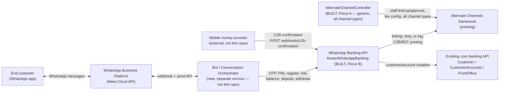
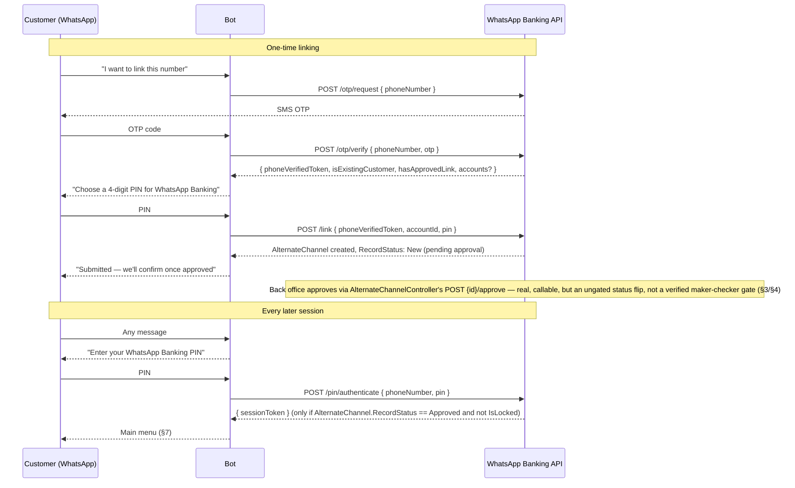
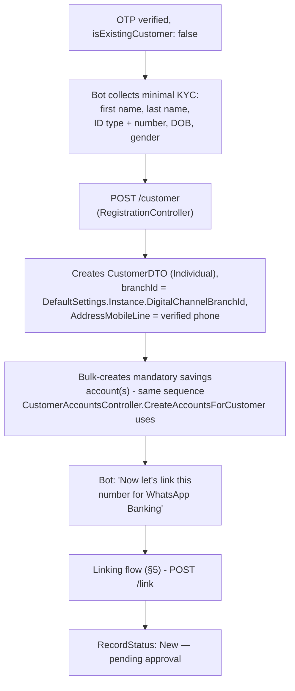
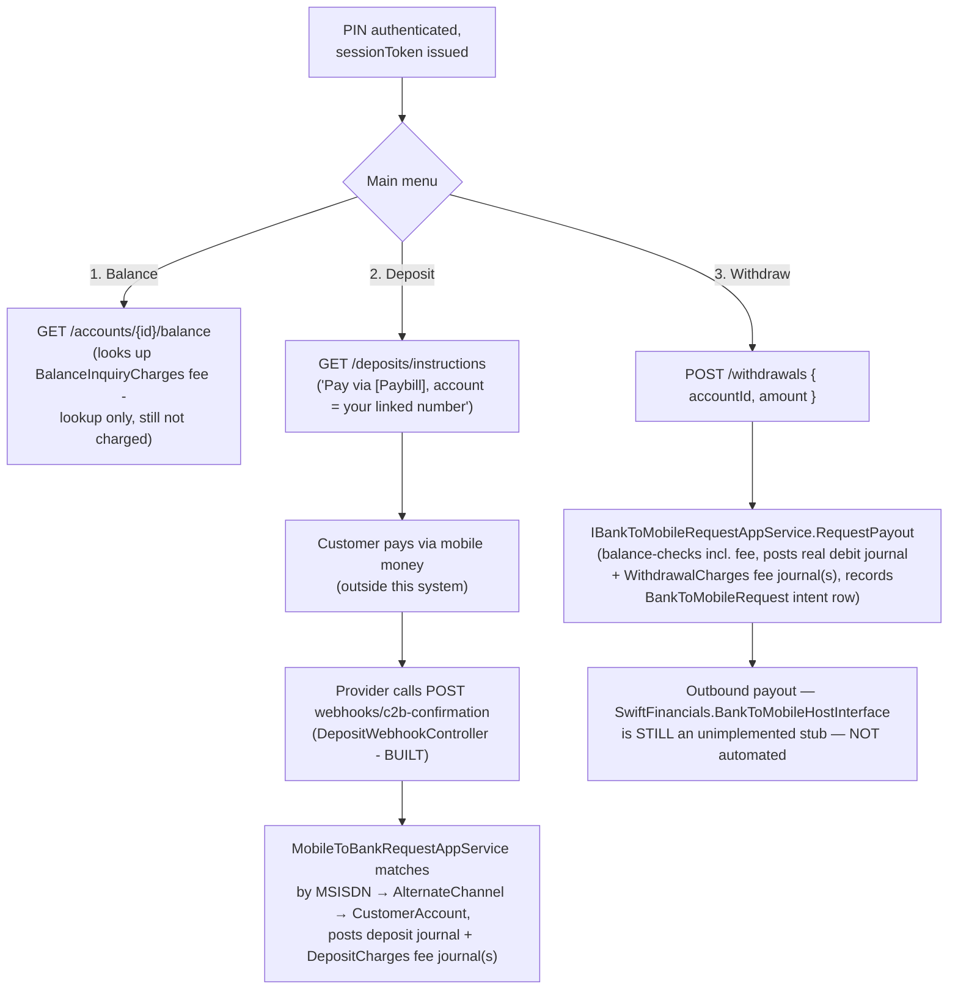

# WhatsApp Banking — Functional Workflow (Front Office Phase)

**Status: built.** `Areas/WhatsAppBanking` now has four real controllers
(`IdentityController`, `RegistrationController`, `TransactionsController`,
`DepositWebhookController`) plus a companion piece — a generic, all-channel
`AlternateChannelController` under `Areas/Accounts` — and this document has
been updated throughout to describe what's actually built rather than what
was proposed. Full integration guide with request/response examples:
`docs/api/whatsapp-banking-api-spec.md`.

Revision history, oldest first: an early draft designed channel identity and
money movement from scratch. Before that shipped, an existing **Alternate
Channels** module was found already living in this codebase
(`AlternateChannel`/`AlternateChannelLog`/`MobileToBankRequest`/
`BankToMobileRequest` — see §3), already partially built for other channels
(Sacco Link, Sparrow, M-Co-op Cash, SpotCash, ...) — the design was revised
to build WhatsApp Banking as a new channel on top of that framework instead
of a parallel one. That revision also split the backend work into two
sequenced pieces (§4): a generic, channel-type-agnostic
`AlternateChannelController` (**Piece A**, no reference-app precedent for
building this per-channel) and the WhatsApp-specific bot-facing API
(**Piece B**). Both are now built. Building them surfaced several real
findings that changed working assumptions along the way — most importantly,
that there is **no real maker-checker gate** for `AlternateChannel` linking
anywhere in this codebase, and that `IBankToMobileRequestAppService`'s
existing method does not actually move money despite its name suggesting
otherwise. Both are called out where relevant below, not glossed over.

Audience: anyone maintaining `Areas/WhatsAppBanking`, or building the
WhatsApp bot/conversation layer that calls it.

Source of truth:
- Customer/account creation (reused as-is):
  `docs/api/customer-api-spec.md`, `docs/api/customer-accounts-api-spec.md`.
- Deposits/withdrawals (existing in-branch path, referenced for comparison):
  `docs/api/frontoffice-api-spec.md` §4.
- OTP delivery: `docs/api/textalert-api-spec.md`.
- **This API's own controllers**: `WebApplication1/Areas/WhatsAppBanking/Controllers/`
  (`IdentityController.cs`, `RegistrationController.cs`,
  `TransactionsController.cs`, `DepositWebhookController.cs`) and the shared
  `WhatsAppBankingTokenStore.cs` (ephemeral OTP/session state) in the same
  Area. Full client spec: `docs/api/whatsapp-banking-api-spec.md`.
- **Alternate Channels framework (this design's foundation)**:
  - Linking: `Domain.MainBoundedContext/AccountsModule/Aggregates/AlternateChannelAgg/AlternateChannel.cs`,
    `Application.MainBoundedContext/AccountsModule/Services/IAlternateChannelAppService.cs`.
  - Channel types/fees: `AlternateChannelType`, `AlternateChannelKnownChargeType`
    in `Infrastructure.Crosscutting.Framework/Utils/Enumerations.cs`.
  - Transaction log + reconciliation: `AlternateChannelLogAgg`,
    `AlternateChannelReconciliationPeriodAgg`/`...EntryAgg`.
  - C2B deposit matching: `Domain.MainBoundedContext/AccountsModule/Aggregates/MobileToBankRequestAgg/`,
    `Application.MainBoundedContext/AccountsModule/Services/MobileToBankRequestAppService.cs`.
  - B2C withdrawal payout: `BankToMobileRequestAgg`,
    `BankToMobileRequestAppService.cs` (now also
    `IBankToMobileRequestAppService.RequestPayout` — new, real GL posting,
    see §7), `SwiftFinancials.BankToMobileHostInterface` (the outbound
    telco-payout host — **still an empty, unimplemented project**).
  - Reference staff UI **Piece A adapts from** — all three are generic,
    keyed off `AlternateChannelDTO.Type`, and cover every existing channel
    type already, not just one: reference app
    `Areas/Accounts/Controllers/RegisterController.cs` (`Linking`, `Create`,
    `Edit`, `Verify`, `Authorize`, `History` actions — the staff linking
    lifecycle), `AlternateChannelsController.cs` and
    `AlternatechannelManagementController.cs` (per-channel-type fee/
    commission configuration).

## 1. What "WhatsApp Banking" means here, this phase

A self-service channel over WhatsApp. A member (or prospective member) chats
with the SACCO's WhatsApp Business number and, without visiting a branch or
talking to a teller, can:

1. Register as a customer, if they aren't one yet, and get a savings
   account opened.
2. Link their phone number as a **WhatsApp Banking alternate channel**
   against that account (§5) — a one-time step, subject to back-office
   approval, same as every other channel this system already supports.
3. Check balance / a mini-statement.
4. Deposit into an account.
5. Withdraw from an account.

All five are now implemented (§6, §7). What's still missing is not API
surface but three deployment prerequisites (§9) and two pieces of real
backend automation (outbound B2C payout, provider-side webhook
registration) that no amount of API design solves by itself.

**Explicitly out of scope this phase** (§8): loan application, anything
back-office/underwriting.

## 2. Actors & systems

- **End customer** — chats via WhatsApp, no app install.
- **WhatsApp Business Platform** — Meta's Cloud API. Not part of this
  codebase.
- **Bot / Conversation Orchestrator** — a new, separate service, **not
  built here** — owns the conversation state machine, renders WhatsApp
  messages, calls the WhatsApp Banking API below. Treated as **the
  frontend** in `docs/api/whatsapp-banking-api-spec.md`.
- **WhatsApp Banking API** (**built, Piece B** —
  `WebApplication1/Areas/WhatsAppBanking/Controllers/`) — OTP/PIN identity,
  registration+linking, balance/deposit-instructions/withdrawal, and the
  inbound C2B webhook. Calls `IAlternateChannelAppService`/
  `IMobileToBankRequestAppService`/`IBankToMobileRequestAppService`
  directly (not over HTTP) for everything channel-shaped, and
  `ICustomerAppService`/`ICustomerAccountAppService` for onboarding.
- **Mobile money provider** — external, not this repo. Calls this API's
  inbound webhook (§7.3) once actually integrated/registered to do so — a
  separate step from the webhook existing.
- **`AlternateChannelController`** (**built, Piece A** —
  `WebApplication1/Areas/Accounts/Controllers/AlternateChannelController.cs`,
  `docs/api/alternate-channel-api-spec.md`) — the staff-facing linking/
  approval/fee-configuration surface, generic across every
  `AlternateChannelType`, not WhatsApp-specific. Sits between the Alternate
  Channels framework and back-office staff, the same role
  `RegisterController`/`AlternateChannelsController` play in the reference
  app. `Areas/WhatsAppBanking` depends on this, it does not reimplement it.
- **Alternate Channels framework** (existing, this repo) — owns channel
  linking, per-channel fees, and (for the money-movement pieces) C2B/B2C
  request logging. Detailed in §3.

## 3. Why this is a new `AlternateChannelType`, not a bespoke design

**What already existed, and was reused as-is:**

- **Linking** (`AlternateChannel` aggregate) — a per-`CustomerAccount`
  record: `Type` (channel), `CardNumber` (MSISDN for a mobile-style
  channel), `MobilePIN`, `DailyLimit`, `IsThirdPartyNotified`/
  `ThirdPartyResponse`, `IsLocked`, `RecordStatus`. Every existing channel
  (Sacco Link, Sparrow, M-Co-op Cash, ...) requires a customer to be
  **linked** before they can transact on it — a real record with a real
  `RecordStatus` field, not implicit. **Correction found building Piece A:
  the *approval step* itself has no enforcement anywhere in the code** —
  `RecordStatus` is just a field anyone with `PUT`/Update access can set to
  anything, including `Approved`, in one call. "Approval" is a UI/process
  convention `AlternateChannelController`'s `POST {id}/approve` builds on
  top of, not a system-enforced gate — see §4 and open question 2 (§9).
- **Fees** (`AlternateChannelKnownChargeType`) — Linking, Replacement,
  Renewal, **Withdrawal, Deposit, Mini Statement, Balance Inquiry**,
  Airtime, **PIN Reset**, resolved per channel type via
  `IAlternateChannelAppService.FindCommissions(channelType, chargeType)`.
  **Deposit and Withdrawal charges are now actually posted**, not just
  looked up — `ICommissionAppService.ComputeTariffsByAlternateChannelType`
  (already fully implemented, keyed by `AlternateChannelType`+
  `AlternateChannelKnownChargeType`, including graduated scales,
  `ChargeBenefactor` Customer-vs-Institution handling, and levy splits —
  found already built and correct when the fee-charging work below started,
  just never called by anything) is now wired into both
  `BankToMobileRequestAppService.RequestPayout` and
  `MobileToBankRequestAppService.AddNewMobileToBankRequest` — see §7 for
  the details. `TransactionsController.GetBalance` still only looks
  `BalanceInquiryCharges` up (§6.2) — balance inquiry doesn't debit
  anything to attach a fee journal to, so posting it is a separate design
  question, not solved by the same wiring — see open question 4 (§9).
- **C2B deposit matching** (`MobileToBankRequest`) — real, working GL
  logic: given an M-Pesa-shaped Paybill confirmation (`MSISDN`,
  `BusinessShortCode`, `TransID`, `BillRefNumber`, `TransAmount`, ...), it
  matches to a `CustomerAccount` either by parsing an encoded account
  reference or **by `MSISDN` against the `AlternateChannel` link**
  (`FindAlternateChannelsByCardNumber` when `MatchByMSISDN: true` — this is
  exactly the WhatsApp linking record from above), then posts a real
  journal (Credit customer's product GL / Debit `MobileWalletC2BSettlement`).
  `DepositWebhookController` (§7.3, built) is what finally makes this
  reachable from outside this system.
- **B2C withdrawal** (`BankToMobileRequest`) — **correction found building
  Piece B**: the existing `AddNewBankToMobileRequest` method does **not**
  debit any account or post any journal, and never references a
  `CustomerAccountId` at all — confirmed by reading its implementation, not
  assumed from the name. It's a bare insert-only intent row. A **new**
  method, `IBankToMobileRequestAppService.RequestPayout`, was added to do
  the real work — see §7.2 for the full story.

**What was genuinely missing, and is now built:**

- A `WebApplication1` controller for all of this — same "fully built,
  WCF-only" shape as ChequeBook/UnPayReason before those got controllers.
  Closed by Piece A (generic, all channel types) and Piece B (WhatsApp
  bot-facing) — see §4.
- **The inbound REST webhook** for a provider to actually call
  `AddNewMobileToBankRequest` with a live C2B confirmation — built,
  `POST /api/whatsappbanking/webhooks/c2b-confirmation` (§7.3). Getting an
  actual provider configured to call it is separate, external work (open
  question 7, §9).
- `AlternateChannelType.WhatsAppBanking = 512` and a matching
  `CheckAlternateChannelNumber` validation case — added (§4).
- **`RequestPayout`** — the real debit-and-post primitive withdrawal needed
  and `AddNewBankToMobileRequest` didn't provide — added (§7.2).
- **`MobilePIN` persistence** — `IAlternateChannelAppService.SetMobilePIN`/
  `VerifyMobilePIN`, hashed via the same `PasswordHash` (PBKDF2) utility
  already used for staff credentials — added. `AddNewAlternateChannel` now
  also accepts and hashes a `MobilePIN` at link time.

**What's still genuinely missing** (§9 has the full list):
`SwiftFinancials.BankToMobileHostInterface` (the outbound B2C payout host)
is still an empty, unimplemented stub — `RequestPayout` posts a real debit
journal, but nothing automatically pays the customer out afterward.

## 4. Sequencing — two controllers, not one (both now built)

Originally prompted by a fair review question: is a dedicated
`WhatsAppBankingController` even the right shape, given the reference app
never builds one controller per channel type? For half of this work, it
isn't — which is why this was built as two separate pieces, not one.

**Piece A — generic `AlternateChannelController` (staff-facing, all
channel types, not WhatsApp-specific). Built.** The reference app never
has a per-channel-type controller for linking/approval/fee management —
every existing channel (Sacco Link, Sparrow, MCo-op Cash, SpotCash, Citius,
Agency Banking, PesaPepe, ABC Bank, Broker) flows through the *same*
generic controllers, keyed off `AlternateChannelDTO.Type`:
- `RegisterController` (`Linking`/`Create`/`Edit`/`Verify`/`Authorize`/
  `History`) — the staff-facing linking lifecycle.
- `AlternateChannelsController` / `AlternatechannelManagementController` —
  per-channel-type fee/commission configuration.

`WebApplication1/Areas/Accounts/Controllers/AlternateChannelController.cs`
(`docs/api/alternate-channel-api-spec.md`) adapts these generically, one
controller for every `AlternateChannelType` — link/update/replace/renew/
stop/delink, paged/filtered listing (including a checker-inbox-shaped
type+status query), approve/reject, and the type-scoped commissions
sub-resource. WhatsApp Banking is just one more `Type` value —
`AlternateChannelType.WhatsAppBanking = 512` and a matching
`CheckAlternateChannelNumber` validation case are in, and confirmed to
require **zero** changes to this controller, exactly as designed.

Real findings from building it, folded into §3 above: the reference
`RegisterController.Verify`/`Authorize` actions are miswired to
`DebitBatchDTO` (nothing to do with `AlternateChannel`), and there is no
real maker-checker gate for channel linking anywhere in this codebase —
`AlternateChannelController`'s `approve`/`reject` actions are a convenience
over an otherwise-ungated `Update` call, not new enforcement.

**Piece B — `Areas/WhatsAppBanking` (customer/bot-facing, WhatsApp-specific,
no reference-app precedent). Built.** `IdentityController` (OTP
request/verify, PIN authenticate/reset), `RegistrationController`
(register + link), `TransactionsController` (accounts, balance, deposit
instructions, withdrawal), `DepositWebhookController` (inbound C2B
confirmation intake). Genuinely new surface, as anticipated: every
existing channel in the reference app is staff-linked at a branch, so
there was no self-service/bot/session concept anywhere to adapt from.
Calls Piece A's underlying app service (`IAlternateChannelAppService`)
rather than duplicating linking/approval logic — it consumes
`RecordStatus`/`IsLocked`, including the fact that "approval" is currently
just an authorized status write, not independently-verified.

**The dependency this section used to describe is resolved**: Piece A no
longer blocks Piece B on "does a checker screen exist" — it exists and
Piece B's `POST /pin/authenticate` genuinely enforces `Approved`+unlocked
before issuing a session. What's left is a product/security question, not
a build dependency: **is an ungated status flip an acceptable approval
mechanism for a financial channel a customer links to themselves over
WhatsApp?** (open question 2, §9). That's a policy decision, not something
either controller's code can resolve.

## 5. Identity — phone verification (OTP) + channel PIN (linking)

Two different mechanisms, used for two different things:

- **OTP** proves momentary control of a phone number. Used only at
  **linking time** (once) and for **PIN reset** (rare) — not on every
  chat session. Delivered by SMS via `ITextAlertAppService.AddQuickTextAlert`
  (`docs/api/textalert-api-spec.md`).
- **`MobilePIN`** (set once, during linking) is what authenticates
  **every subsequent transacting session** — the same convention every
  other `AlternateChannel` in this system already uses. The bot prompts
  for it at the start of a balance/deposit/withdraw flow, not a fresh OTP
  each time. **Built**: `IAlternateChannelAppService.SetMobilePIN`/
  `VerifyMobilePIN`, hashed via the same `PasswordHash` (PBKDF2) utility
  already used for staff credentials in `EmployeePasswordHistoryAppService`
  — never stored or returned in plain text.
  `AccountsModuleProfile`'s `AlternateChannel → AlternateChannelDTO` map
  was also fixed to exclude `MobilePIN` from projection, so the hash can
  never leak through any read endpoint (`AlternateChannelController`'s
  `GET`s included) — a real gap caught while building this, not a
  hypothetical one.

- Linking is **self-service-initiated but not self-service-approved** —
  consistent with every existing channel, none of which let a customer
  activate themselves. This adds latency that in-branch linking doesn't
  have; a deliberate trade for not requiring a branch visit, not an
  oversight. There's no push/poll mechanism for the bot to learn when
  approval happens (open question 5, §9) — it has to retry
  `POST /pin/authenticate` and see whether `403` stops.
- `isExistingCustomer: false` at OTP-verify time routes into registration
  (§6) before linking is even possible — `AlternateChannel` is
  per-`CustomerAccount`, so a brand-new WhatsApp user needs an account to
  link *to* first. `isExistingCustomer` detection checks two places, in
  order: any existing `AlternateChannel` (any type) by `CardNumber`, then
  `Customer.Address.MobileLine` — a member who's never linked any channel
  is still correctly detected as existing, not silently duplicated.
- **Still open** (§9): retry-lockout behavior (`AlternateChannel.IsLocked`
  exists as a field; nothing sets it after N failed PIN attempts),
  multi-instance session/OTP storage (currently in-process cache only).
  `DailyLimit` sourcing is resolved — `DefaultSettings.Instance.AlternateChannelsDefaultDailyLimit`
  (`40000`) already existed as a real config knob and is used directly.

## 6. Flow: new customer — registration, then linking

Flows straight into §5's linking step rather than ending at "you're set
up" — a new customer isn't actually able to transact over WhatsApp until
linking is approved, same as an existing customer.

**Digital Channel Branch — resolved as a deployment prerequisite, not a
design gap**: `DefaultSettings.Instance.DigitalChannelBranchId` (`Guid`,
new settable property) is where a self-onboarded customer's branch comes
from. Nothing in the domain has (or needs) a special "digital branch"
concept — this is a real `Branch` row back office creates once, same as
any other branch, and points this setting at. `POST /customer` returns
`500` until it's set — see the deployment-prerequisites table in
`docs/api/whatsapp-banking-api-spec.md`.

**KYC document capture** is still not designed here — unchanged open item
(§9).

## 7. Flow: returning, linked customer — balance, deposit, withdrawal

- **Fees — deposit and withdrawal now actually post, balance inquiry still
  doesn't**: `ICommissionAppService.ComputeTariffsByAlternateChannelType`
  turned out to already be fully implemented (graduated scales,
  `ChargeBenefactor` Customer-vs-Institution handling, levy splits, the
  same computation `CustomerAccountAppService.ChargeAccountActivationFee`
  already proves out in production) — it just had no caller anywhere. It's
  now called from both money-movement paths below. `GET /accounts/{id}/balance`
  still only looks `BalanceInquiryCharges` up and reports `feeApplicable` —
  balance inquiry doesn't debit anything to attach a fee journal to, so
  charging it is a separate design decision (what would it debit?), not
  solved by this same wiring — open question 4 (§9) is now scoped down to
  just that.
- **Deposit is customer-funds-first, confirmation-driven** — the bot does
  not itself move money; `GET /deposits/instructions` tells the customer
  how to pay (Paybill/shortcode from `DefaultSettings.Instance.MobileMoneyPaybillBusinessShortCode`
  + their linked phone as the reference), and `DepositWebhookController`
  → `MobileToBankRequestAppService`'s existing matching/posting logic
  takes over once a confirmation arrives, with `MatchByMSISDN: true` set
  explicitly (it defaults `false` on the DTO — easy to silently get wrong,
  confirmed by reading `MatchCustomerAccount` directly). `MatchCustomerAccount`
  now also surfaces which `AlternateChannelType` actually matched (only
  meaningful for the MSISDN match path, not the two BillRefNumber-encoded
  paths), which `AddNewMobileToBankRequest` uses to look up and post any
  configured `DepositCharges` for that channel type, as its own additional
  journal(s) in the same `BulkSave` batch as the deposit itself. **The
  webhook existing is necessary but not sufficient** — an actual provider
  has to be configured to call it (open question 7, §9).
- **Withdrawal does a real debit, now inclusive of any configured fee**,
  via `IBankToMobileRequestAppService.RequestPayout` — balance-checked
  against `AvailableBalance` (the check now includes the computed
  `WithdrawalCharges` amount, not just the withdrawal itself — a request
  that would leave the account short once the fee is added is rejected,
  not partially processed), checked against the linked channel's
  `DailyLimit`, posts Debit customer's product G/L / Credit
  `SystemGeneralLedgerAccountCode.MobileWalletB2CSettlement` (the mirror
  of how C2B deposits post, in reverse) plus one journal per fee tariff,
  and records a `BankToMobileRequest` row. **What still doesn't exist**:
  `SwiftFinancials.BankToMobileHostInterface`,
  the process that would actually pay the customer out over mobile money —
  still an empty stub. `TransactionsController`'s success response says so
  explicitly (`"...back office will process it manually"`) rather than
  implying automated payout — this was a deliberate correctness fix, not
  copy-editing; the earlier draft's planned message ("you'll receive it
  shortly") would have been a materially false claim about a real
  customer's money.

## 8. Roadmap — Phase 2 (not designed yet)

Loan application over this same channel is the natural next step once
customer/account/linking/deposit/withdrawal is live and stable, but needs
its own audit of the loan/underwriting domain first — not part of this
document.

## 9. Open items — what's left, now that both pieces are built

**Deployment prerequisites (config, not code)** — see the table at the top
of `docs/api/whatsapp-banking-api-spec.md`. All three are now real
`<appSettings>` keys in `WebApplication1/Web.config`, read into
`DefaultSettings.Instance` on every access — set them there, no code change
or controller needed:
1. `DigitalChannelBranchId` (→ `DefaultSettings.Instance.DigitalChannelBranchId`)
   — back office must create a Branch for self-onboarded customers and
   point this at it.
2. `MobileMoneyPaybillBusinessShortCode` (→ `DefaultSettings.Instance.MobileMoneyPaybillBusinessShortCode`)
   — the real Paybill/shortcode customers pay into.
3. `MobileToBankWebhookSecret` (→ `DefaultSettings.Instance.MobileToBankWebhookSecret`)
   — shared secret the inbound webhook checks; unset means every webhook
   call is refused.

**Real backend work still not built:**
4. **Outbound B2C payout automation** — `SwiftFinancials.BankToMobileHostInterface`
   needs an actual implementation (or a decision to route B2C payouts some
   other way) before withdrawal payout is automated. `RequestPayout`'s
   debit is real; nothing consumes the `BankToMobileRequest` queue it
   populates.
5. **Provider integration for the inbound webhook** — the endpoint is
   real and correctly wired to `MobileToBankRequestAppService`; getting an
   actual mobile money provider (Safaricom or whoever) configured to call
   it with live confirmations is separate, external work this document
   can't do for you. Confirm the request shape (§7.3 of the API spec)
   against the real provider's callback format before going live —
   `MobileToBankRequestDTO`'s field names are mirrored directly, not
   guaranteed to match any specific provider's API 1:1.

**Product/security decisions, not engineering defaults:**
6. **Self-service linking approval mechanism** — `POST {id}/approve` is
   real and callable, but it's an ungated status flip (no check the
   record is currently `New`, no maker-vs-checker identity check). Is
   that acceptable for a channel a customer links to themselves over
   WhatsApp, or does it need real maker-checker domain work first? Also
   unresolved: what's an acceptable approval turnaround time, and how does
   the bot learn approval happened (poll `pin/authenticate`? a push
   mechanism)?
7. **Fee charging — narrowed, not fully closed.** `DepositCharges` and
   `WithdrawalCharges` are now real: `MobileToBankRequestAppService.AddNewMobileToBankRequest`
   and `BankToMobileRequestAppService.RequestPayout` both compute and post
   them via `ICommissionAppService.ComputeTariffsByAlternateChannelType`
   (found already fully implemented — graduated scales, `ChargeBenefactor`
   Customer/Institution handling, levy splits — just never called by
   anything before this). Still open: `BalanceInquiryCharges` (§6.2 is
   lookup-only — balance inquiry doesn't debit anything, so charging it
   needs its own design decision, not just a call to the same method) and
   `PINResetCharges` (same reasoning, `pin/reset` doesn't debit anything
   either). Whether either of those two should charge at all — some
   channels don't — is a product decision, not resolved here.
8. **PIN retry-lockout policy** — `AlternateChannel.IsLocked` exists;
   nothing sets it automatically after failed `pin/authenticate` attempts.
   How many attempts, and is a 4-digit PIN (vs. a longer one) an
   acceptable step-down from OTP-per-session for a financial channel —
   needs security/compliance input, not resolved here.
9. **Compliance/AML** — this system's only precedent for channel access
   before WhatsApp Banking was staff-vetted, in-branch linking. A
   self-service-initiated (even if approval-gated) linking flow is a real
   departure from that precedent and needs sign-off, not an engineering
   default.
10. **KYC document capture** at registration — not designed here.

**Scaling concern, not a functional gap:**
11. **Multi-instance session/OTP storage** — `WhatsAppBankingTokenStore`
    is backed by an in-process cache (`IAppCache`). Fine for a
    single-instance pilot; needs moving to a shared store (Redis, a DB
    table) before this can run behind a load balancer with more than one
    instance.
