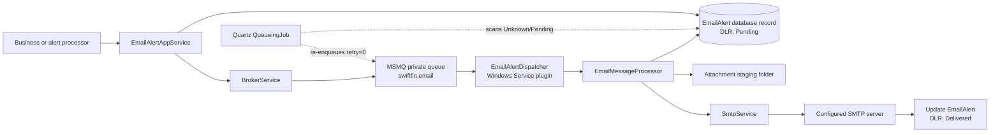

# Email Delivery Process

This document describes how SwiftFinancialz creates, queues, sends, and
tracks email. Email delivery is asynchronous from the business operation:
the web/application process persists an alert and places a reference on
MSMQ; a separate Windows Service performs the SMTP call.

## End-to-end flow

### 1. Create and persist the alert

A business process creates an `EmailAlertDTO` and calls
`IEmailAlertAppService.AddNewEmailAlert`. The service:

1. Requires a non-empty recipient matching its email regular expression.
2. Sets the delivery-report status (`DLRStatus`) to `Pending` for messages
   originating within or outside the application.
3. Persists an `EmailAlert` containing sender, recipients, CC, subject,
   body, HTML flag, priority, security flag, and attachment names.
4. Calls `IBrokerService.ProcessEmailAlerts` after the database save.

The database record is the durable message definition. The queue message
contains only the alert ID and application-domain identifier.

Relevant code:

- `Application.MainBoundedContext/MessagingModule/Services/EmailAlertAppService.cs`
- `Domain.MainBoundedContext/MessagingModule/Aggregates/EmailAlertAgg/`
- `Domain.MainBoundedContext/ValueObjects/MailMessage.cs`

### 2. Place the alert on MSMQ

`BrokerService.ProcessEmailAlerts` sends a `QueueDTO` to the configured
email-dispatcher queue for `Unknown` or `Pending` alerts whose
`MailMessageSendRetry` is zero. The active web configuration points this
to the local private MSMQ queue `swiftfin.email`.

This step does not send email. It only hands the persisted alert ID to the
background dispatcher.

Relevant code and configuration:

- `Application.MainBoundedContext/Services/BrokerService.cs`
- `WebApplication1/Web.config` (`serviceBrokerConfiguration`)
- `Infrastructure.Crosscutting.Framework/Models/QueueDTO.cs`

### 3. Consume the queue in the Windows Service

`SwiftFinancials.WindowsService` loads the `EmailAlertDispatcher` plugin.
Its `EmailMessageProcessor` listens to the configured MSMQ path. For each
queue item it:

1. Selects SMTP settings whose `uniqueId` matches the queued
   `ApplicationDomainName`.
2. Reloads the full `EmailAlertDTO` from the database.
3. Ignores records no longer in `Unknown` or `Pending` status.
4. Resolves comma-separated attachment names against the configured
   attachment staging folder, including only files that exist.
5. Calls `ISmtpService.SendEmail`.

Although an alert contains a `From` value, the dispatcher sends from the
configured SMTP username and records that value back onto the alert.

Relevant code:

- `SwiftFinancials.EmailAlertDispatcher/Services/Dispatcher.cs`
- `SwiftFinancials.EmailAlertDispatcher/Configuration/EmailMessageProcessor.cs`
- `SwiftFinancials.WindowsService/App.config` (`emailDispatcherConfiguration`)

### 4. Send through SMTP and record the result

`SmtpService` uses `.NET Framework`'s synchronous
`System.Net.Mail.SmtpClient`. It configures the host, port, SSL flag, and
username/password credentials, builds the `MailMessage`, adds available
attachments, and calls `SmtpClient.Send`.

If that call returns without throwing, the dispatcher updates the alert:

- `MailMessageDLRStatus = Delivered`
- `MailMessageSendRetry = 1`
- `MailMessageFrom = configured SMTP username`

Here, **Delivered means accepted by the configured SMTP server**. It does
not prove delivery to the recipient's inbox and there is no bounce or
delivery-status-notification processing in this pipeline.

Relevant code:

- `Application.MainBoundedContext/Services/SmtpService.cs`
- `Application.MainBoundedContext/MessagingModule/Services/EmailAlertAppService.cs`

## Scheduled recovery scan

The email dispatcher also contains a Quartz `QueueingJob`. On its configured
cron schedule it scans recent `Unknown` and `Pending` database alerts and
re-enqueues records whose `MailMessageSendRetry` is still zero. This can
recover a record persisted when the initial broker enqueue did not happen.

This scan is not a complete retry policy: it does not record attempt counts,
apply exponential backoff, move permanently failing mail to a dead-letter
state, or expose a terminal failure reason.

Relevant code:

- `SwiftFinancials.EmailAlertDispatcher/Services/Queuer.cs`
- `SwiftFinancials.EmailAlertDispatcher/Configuration/QueueingJob.cs`

## Message sources

Email alerts may be created directly through `EmailAlertAppService`, as
quick/group messages, or indirectly by `SwiftFinancials.AccountAlertDispatcher`.
The account-alert processor creates customer-facing email for events such
as loan requests, deferred loans, membership approval, account closure,
account freezing, and alternate-channel operations.

`WebApplication1` exposes `api/messaging/emailalerts` for manual composition,
paged/status/date-filtered history, and detail retrieval. Automated alerts
are also created internally by application/dispatcher processes. The REST
controller only queues mail; it does not bypass this document's dispatcher
pipeline or expose the dispatcher's delivery-state update operation.

## Runtime prerequisites

- Windows Message Queuing (MSMQ) is installed.
- The configured private queues exist and the web app and service accounts
  can write/read them.
- `SwiftFinancials.WindowsService` is installed and running with the email
  dispatcher and queuer plugins enabled.
- The web app and Windows Service use compatible database and queue settings.
- The queue item's application-domain name matches an enabled email
  dispatcher settings entry.
- SMTP host, port, TLS setting, username, and credential are valid.
- The service account can read the attachment staging folder.
- Network/firewall policy permits outbound SMTP traffic.

## Operational and security cautions

- SMTP credentials must not be committed in plaintext. Use an
  environment-specific protected secret source and rotate any credential
  that has previously been committed.
- Queue payloads currently carry SMTP configuration fields in some recovery
  paths. Credentials should remain inside the dispatcher process instead of
  being serialized into transport messages.
- `SmtpClient.Send` is synchronous, so a slow SMTP server occupies a queue
  worker until the call completes.
- Missing attachment files are silently omitted.
- A database save can succeed while the immediate enqueue fails. The Quartz
  scan provides partial recovery, but monitoring should alert on old
  `Unknown`/`Pending` records.
- There is no provider message ID, bounce handling, dead-letter workflow, or
  recipient-level delivery evidence.

## Suggested production monitoring

At minimum, monitor:

- age and count of `Unknown` and `Pending` email alerts;
- MSMQ queue depth and oldest-message age;
- Windows Service/plugin health;
- SMTP exceptions and authentication failures;
- alerts marked `Delivered` per time period;
- attachment staging-folder access failures.
